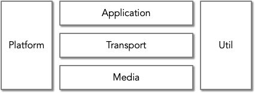

#  libuavcan v1.0 development

v1.0 is a complete rewrite of libuavcan with the following, fundamental changes from v0:

1. libuavcan v1 is based on the [UAVCAN v1 specification](https://new.uavcan.org).
1. libuavcan v1 requires C++11 or greater.
1. libuavcan v1 favors idiomatic C++ over defining its own utilities and helpers.
1. libuavcan v1 is a header-only library.
1. libuavcan v1 holds itself to a higher quality standard and is designed for integration into high-integrity, embedded applications.

## About the Blue Sky effort

You should never rewrite a codebase from scratch. It's a terrible idea. We're rewriting libuavcan from scratch. We're terrible developers.

Sorry.

The reason we opted for a complete rewrite is that so much is changing. Between the updates to the specification, the abandonment of C++98 support, switching to header-only, removing the drivers from the main repository, adding CAN FD support, etc, etc, etc; it was obvious that we'd be rewriting everything anyway. The good news is that v0 exists, is fully supported, and will be liberally copy-and-pasted from as this makes sense for v1. What we don't have is any git history tracing from v0 to v1 since this would be deceiving. Futhermore, the unit tests in uavcan v0 are a bit of a mess so we'll be writing them in a way that is more sustainable.

If you are contributing to the initial v1 effort the place to start is v0.

1. Find the next chunk of v0 functionality to port over to v1, copy-and-paste, rough-out the new tests, and start rewriting as headers-only.
2. Replace all custom TMP and SFINAE constructs with their C++ equivalents, use the standard library appropriately, and continue to develop the tests as you redesign the code.
3. Review all ["milestone constraints" for v1](https://github.com/UAVCAN/libuavcan/issues?q=is%3Aopen+is%3Aissue+label%3A%22milestone+constraint%22+label%3Av1) and make sure the v1 version of your refactored code doesn't violate any of these. Milestone constraints are issues for things found in v0 that we don't want v1 to have. Think of these issues as filters you must apply to all v0 code when it is ported to v1.

## Design goals

Libuavcan's design goals should be mutually compatible. There is no expectation that any significant compromises are needed to achieve all goals given that the architecture should support making trade-offs at compile-time based on a user's build settings.

* **Full-Featured**

    This library provides a complete implementation of the specification including some of the application-level functions defined in section 5.3 of the specification.

* **Header-only, no dependencies, idiomatic**

    Libuavcan is provided as C++11 headers with no external dependencies. The headers do not impose styles or conventions on the user and make the maximum use of C++ templates to allow type flexibility when no specific type is optimal.

* **Deterministic by default**

    The parameterized types used should allow for deterministic time and memory complexity when used in a *default* configuration. At the same time, the user may provide non-default types that utilize unbounded memory and/or runtime complexity if desired.

* **Portable**

  * The library should not present any specific requirements to the underlying hardware or OS, and it must be coded in standard C++11 and be immediately forward compatible to at least C++20 while minimizing use of any deprecated constructs that may limit its compatibility with future versions of C++.
  * The library should make conservative use of C++ with an eye towards compatibility with coding standards like [Autosar](https://www.autosar.org/fileadmin/user_upload/standards/adaptive/17-03/AUTOSAR_RS_CPP14Guidelines.pdf), HIC++, and the [ISOCpp Core Guidelines](http://isocpp.github.io/CppCoreGuidelines/CppCoreGuidelines).
  * The library must build on as many different, standards-compliant, C++ compilers as is reasonable. At the time of this writing this includes gcc and clang.
  * The library must build for as many different architectures as is reasonable. At the time of this writing this includes arm, arm64, x86, and x86_64.

* **Powerful and Flexible**

    This library should enable the full power of UAVCAN scaling up in capability with the target platform but remaining functional for even deeply embedded targets. Furthermore, the code should enable the full power of a given system allowing for use in high-performance and/or hard-realtime systems.

* **Clear/Fluent**

    While maximal in implementing the specification, libuavcan should be clearly structured and well-documented. It should prefer additional verbosity over compressed syntax and should utilize object-oriented principles to their greatest effect by creating logically named objects using well-known patterns.

* **Modular**

    The library should allow sequential adoption of its four layers: platform, media, transport, and application such that users can implement and test each layer in that sequence. The headers should allow compilers to elide the maximum amount of unused code such that the actual cost of the library in ROM is smaller when using fewer application features.

## Documentation

* [UAVCAN website](http://uavcan.org)
* [UAVCAN forum](https://forum.uavcan.org)
* [HIL testing](https://nanaimo.readthedocs.io/en/latest/docs/guide.html)

## Architecture

### High Level

The architecture of v1 is composed of three primary layers and one portability layer:



#### Util(ity)

Because of the design goal to provide "idiomatic C++," utilities used throughout the library should be minimal and non-trivial (i.e. avoid syntactic sugar). This layer shall contain purely logical constructs and *shall not* contain any abstract objects or anything requiring porting to a given platform. Ideally utilities are used only by libuavcan internals allowing users to write their own syntactic sugar using idioms natural to their codebase.

#### Platform

This layer must remain as minimal as possible ideally being implemented solely using C++ standard library functionality. This layer contains the objects and types used by all other layers when accessing system resources like memory, threads, or filesystems. Additionally this layer provides abstractions where architectural optimizations may be available for some conceivable target platform. For example, were the library to use memory in a way that could be optimized using SIMD instructions this layer would provide an abstraction such that SIMD optimizations could be enabled for an operation while providing a fallback where the optimization is not provided or is not available.

#### Media

*(In V0 this was known as the "driver" layer)* The media layer provides an abstraction on top of networking peripherals. It is distinct from the platform layer since this is a networking protocol that should make minimal, direct use of the underlying platform.

#### Transport

The OSI layer 4 implementation of UAVCAN per section 4 of the specification. Uses types and serialization support provided by [Nunavut](https://github.com/uavcan/nunavut). Note that this is where the "node" objects will be mapped to.

#### Application

Implementation of section 5 "Application" of the UAVCAN specification.


### Threading model

The library should be single-threaded, not thread-aware.
Hence the API will be not thread-safe, which is OK as most applications will likely be running all of the UAVCAN-related logic in one thread.

The documentation should provide advices about how to integrate the library in a multithreaded environment.

### Endianess

UAVCAN is little-endian on the wire. Because of this big-endian platforms may use more CPU than the same code on a little-endian platform.

### Code generation

All code generation is performed by [Nunavut](https://github.com/UAVCAN/nunavut).

### Folder Structure

**/libuavcan/include** - Contains the entire header-only libuavcan library.

**/libuavcan_validation_suitet** – Test utilities provided to consumers of the library. These are public test fixtures and should be documented, maintained, and designed with the same care given to the rest of the library.

**/test/native** - Unit-tests that validate the libuavcan library. These tests compile and execute using the build host's native environment. They also do not require any communication interfaces, virtual or otherwise, from the operating system and have no timing constraints.

**/test/ontarget** - Tests cross-compiled for specific hardware* and run on a set of dedicated test devices. These tests may have strict timing constraints and may require specific physical or virtual busses and other test apparatuses be present. Each on-target test will fully document its requirements to enable anyone with access to the appropriate hardware to reproduce the tests. Furthermore, these tests must be inherently automateable having clear pass/fail criteria reducible to a boolean condition.

**/test/compile** – Tests that run in the compiler. Most of these will be tests that pass if they fail to compile. For example, some tests will purposefully define template parameters that will cause static_asserts to fail. Tests that pass if they do compile are less interesting here since such happy paths are normally covered by unit-tests.

**/test/linux** - Tests that run on SocketCAN/Linux. These are provided partially as examples and partially to prove the library functions on a real platform.

### Test Environments

The following list of standardized* test environments will be used to validate the libuavcan implementation**:

1. **Posix** - We will produce examples that can run on top of SocketCAN on a recent version of an Ubuntu-based distro. While we expect that these examples will be generally compatible with other common GNU/Linux distros or POSIX compliant operating systems (that also support SocketCAN) we will compile and test the examples using Ubuntu as part of our CI build.
1. **Bare-metal on NXP S32K148 devkit** - We expect to produce examples and tests that run on the S32K148 MCU populated on the standard S32K148 evaluation board available from NXP. This is the primary test fixture for the project and will be used as the basis for specifying on-target test rigs.
1. **Nuttx on Pixhawk** - We expect to produce examples and possibly tests that can run on top of the latest Pixhawk hardware and version of Nuttx used by the PX4 software stack. This is a lower-priority for the initial development for v1 but will become a focus once we have a fully functional stack.

\* Note that libuavcan is a header only library suitable for a wide range of processors and operating systems. The targets and test environments mentioned here are chosen only as standardized test fixtures and are not considered more "supported" or "optimal" than any other platform.

## Library development

**Libuavcan development should be test-driven. Write the tests first.**

**Libuavcan source should be fluent. Comment everything in plain prose, build the docs with each change, read the docs to make sure your comments make sense.**

Despite the fact that the library itself can be used on virtually any platform that has a standard-compliant
C++11 compiler, the library development process assumes that the host OS is Linux or OSX.

Prerequisites:

* Google test library for C++ - gtest (downloaded as part of the build from [github](https://github.com/google/googletest))
* C++11 capable compiler (e.g. GCC, Clang)
* CMake 3.5+
* clang-format
* clang-tidy
* python3
* nunavut and (transitively) pydsdl

Building the debug version and running the unit tests:

```bash
mkdir build
cd build
cmake ..
make -j8
make ARGS=-VV test
```

We also support a docker-based workflow which is used for CI build automation. If you want to use this locally either to verify that the CI build will succeed or just to avoid manually installing and maintaining the above dependencies then you can do:

```bash
docker pull uavcan/c_cpp:ubuntu-18.04

docker run --rm -v ${PWD}:/repo uavcan/c_cpp:ubuntu-18.04 /bin/sh -c ./ci/native-gcc-build-and-test.sh
```

Test outputs can be found in the build directory under `libuavcan`.

Contributors, please follow the [Zubax C++ Coding Conventions](https://kb.zubax.com/x/84Ah) and always use `clang-format` when authoring or modifying files (the build scripts will enforce but not apply the rules in .clang-format).

### Pull-Request Checklist

Reviewers, please check the following items when reviewing a pull-request:

> **NOTE:** This is just the start of this checklist. Expect it to grow and get refined as this project matures.

1. **correctness**
    * Is the code correct.
2. **clarity**
    * Is the code easily understood?
    * It is overly complex?
3. **test coverage**
    * Were tests written to cover the changes?
4. **test effectiveness and correctness**
    * Are the tests good tests that provide some guarantee that the logic is, and will remain, correct?
5. **documentation**
    * Is the code properly documented?
    * Are there changes needed to auxillary documentation that is missing?
    * Are there good examples for how to use the code?
6. **design**
    * Is the code maintainable?
    * Are the tests maintainable?
    * Is the code in the right namespace/class/function?

### VSCode

To use visual studio code to debug ontarget tests for the S32K148EVB you'll need the [cortex debug](https://marketplace.visualstudio.com/items?itemName=marus25.cortex-debug) plugin. Here's an example configuration using JLink:

```yaml
 {
    "cwd": "${workspaceRoot}",
    "executable": "build/test_util_math.elf",
    "name": "On-target unit test.",
    "request": "launch",
    "type": "cortex-debug",
    "servertype": "jlink",
    "device": "S32K148",
    "svdFile": "test/ontarget/S32K148EVB/S32K148.svd"
},
```
