# LibCyphal design overview

LibCyphal is a high-level header-only wrapper over the existing Cyphal implementation libraries, such as LibCANard and LibUDPard (collectively referred to as lizards :lizard:), implemented in C++14 following high-integrity software development practices. It aims to be a full-featured implementation that comes with batteries included and is easy to integrate into any real-time application, from deeply embedded baremetal MCUs up to a conventional POSIX OS (such as GNU/Linux).

The library consists of several modules listed below.

**`libcyphal::transport`** abstracts the lizards via `ITransport` and provides glue logic between the lizards and the platform layer. At this layer, data is represented as serialized binary blobs rather than DSDL objects. There is a dedicated module per lizard, plus additional auxiliary modules:

- `libcyphal::transport::can` -- Cyphal/CAN-specific module and the platform layer abstractions.
- `libcyphal::transport::udp` -- Cyphal/UDP-specific module and the platform layer abstractions.
- more transport-specific modules may be added here, such as `serial` for Cyphal/serial.
- `libcyphal::transport::redundant` -- an aggregate over `ITransport` that builds a redundant Cyphal transport over a set of underlying instances of `ITransport`.
- `libcyphal::transport::commons` -- a collection of reusable components shared between different transports.

In certain minimal applications, the transport layer can be used directly, independently of the higher-level layers.

**`libcyphal::presentation`** is a layer on top of the transport layer that serves multiple purposes:

- Provides DSDL (de)serialization by invoking Nunavut-generated code appropriately. This provides a higher-level API for the user code that operates on DSDL objects instead of raw binary blobs.
- Demultiplexes incoming transfers across multiple consumers. This allows the application to instantiate multiple subscribers for a given subject simultaneously.
- Provides a convenient interface for invoking and serving RPC service calls.

**`libcyphal::application`** is a layer on top of the previous two that provides the top-level node-centric API for the application and implements some common functions of the protocol, such as the register interface, publication of heartbeats and port usage messages, and so on. This is where the included batteries can be found. Unlike the lower layers, the application layer depends on the code generated by Nunavut from certain standard DSDL definitions.

## Transport layer

### Overview

```mermaid height=203,auto
classDiagram
%% ERROR MODEL
class Error {<<variant>>}
Error -- StateError
Error -- AnonymousError
Error -- ArgumentError
Error -- MemoryError
Error -- PlatformError
class PlatformError {
    +code: u32
}

class ProtocolParameters {
    +transfer_id_modulo: u64
    +max_nodes: u16
    +mtu: u32
}

%% RUNNABLE
class IRunnable {
    <<interface>>
    +run(poll_set: IPollSet&)
}

%% DYNAMIC BUFFER
class DynamicBuffer {
    +copy(offset: std::size_t, destination: void*, size_bytes: std::size_t) std::size_t
}

%% TRANSFERS
class TransferMetadata {
    +timestamp: Timestamp
    +priority: Priority
    +transfer_id: u64
}
class ServiceTransferMetadata {
    +remote_node_id: u16
}
TransferMetadata <|-- ServiceTransferMetadata
class MessageRxTransfer {
    +meta: TransferMetadata
    +publisher_node_id: cetl::optional~u16~
    +payload: DynamicBuffer
}
TransferMetadata o-- MessageRxTransfer
class ServiceRxTransfer {
    +meta: ServiceTransferMetadata
    +payload: DynamicBuffer
}
ServiceTransferMetadata o-- ServiceRxTransfer

%% SESSIONS
class ISession {
    <<interface>>
}
IRunnable <|-- ISession
class IMessageRxSession {
    <<interface>>
    +receive() MessageRxTransfer
    +getParams() MessageRxSessionParams
    +setTransferIDTimeout(timeout: Duration)
}
ISession <|-- IMessageRxSession
class IMessageTxSession {
    <<interface>>
    +send(meta: TransferMetadata, payload_fragments: cetl::span<cetl::span<u8>>) cetl::optional~Error~
    +getParams() MessageTxSessionParams
}
ISession <|-- IMessageTxSession
class IRequestRxSession {
    <<interface>>
    +receive() ServiceRxTransfer
    +getParams() RequestRxSessionParams
    +setTransferIDTimeout(timeout: Duration)
}
ISession <|-- IRequestRxSession
class IRequestTxSession {
    <<interface>>
    +send(meta: TransferMetadata, payload_fragments: cetl::span<cetl::span<u8>>) cetl::optional~Error~
    +getParams() RequestTxSessionParams
}
ISession <|-- IRequestTxSession
class IResponseRxSession {
    <<interface>>
    +receive() ServiceRxTransfer
    +getParams() ResponseRxSessionParams
    +setTransferIDTimeout(timeout: Duration)
}
ISession <|-- IResponseRxSession
class IResponseTxSession {
    <<interface>>
    +send(meta: ServiceTransferMetadata, payload_fragments: cetl::span<cetl::span<u8>>) cetl::optional~Error~
    +getParams() ResponseTxSessionParams
}
ISession <|-- IResponseTxSession

class MessageRxSessionParams {
    +subject_id: u16
    +extent_bytes: std::size_t
    +transfer_id_timeout: Duration
    +buffer_size: std::size_t
}
class MessageTxSessionParams {
    +subject_id: u16
}

class RequestRxSessionParams {
    +service_id: u16
    +extent_bytes: std::size_t
    +transfer_id_timeout: Duration
    +buffer_size: std::size_t
}
class RequestTxSessionParams {
    +service_id: u16
    +server_node_id: u16
}

class ResponseRxSessionParams {
    +service_id: u16
    +server_node_id: u16
    +extent_bytes: std::size_t
    +transfer_id_timeout: Duration
    +buffer_size: std::size_t
}
class ResponseTxSessionParams {
    +service_id: u16
}

%% TRANSPORT INTERFACE
class ITransport {
    <<interface>>
    +getLocalNodeID() cetl::optional~u16~
    +getProtocolParameters() ProtocolParameters

    +makeMessageRxSession(params: MessageRxSessionParams) cetl::expected#60;UniquePtr~IMessageRxSession~,Error#62;
    +makeMessageTxSession(params: MessageTxSessionParams) cetl::expected#60;UniquePtr~IMessageTxSession~,Error#62;

    +makeRequestRxSession(params: RequestRxSessionParams) cetl::expected#60;UniquePtr~IRequestRxSession~,Error#62;
    +makeRequestTxSession(params: RequestTxSessionParams) cetl::expected#60;UniquePtr~IRequestTxSession~,Error#62;

    +makeResponseRxSession(params: ResponseRxSessionParams) cetl::expected#60;UniquePtr~IResponseRxSession~,Error#62;
    +makeResponseTxSession(params: ResponseTxSessionParams) cetl::expected#60;UniquePtr~IResponseTxSession~,Error#62;

    +iterateMessageRxSessions() std::pair#60;MessageRxSessionIterator,MessageRxSessionIterator#62;
    +iterateMessageTxSessions() std::pair#60;MessageTxSessionIterator,MessageTxSessionIterator#62;

    +iterateRequestRxSessions() std::pair#60;RequestRxSessionIterator,RequestRxSessionIterator#62;
    +iterateRequestTxSessions() std::pair#60;RequestTxSessionIterator,RequestTxSessionIterator#62;

    +iterateResponseRxSessions() std::pair#60;ResponseRxSessionIterator,ResponseRxSessionIterator#62;
    +iterateResponseTxSessions() std::pair#60;ResponseTxSessionIterator,ResponseTxSessionIterator#62;
}
IRunnable <|-- ITransport
IMessageRxSession o-- ITransport
IMessageTxSession o-- ITransport
IRequestRxSession o-- ITransport
IRequestTxSession o-- ITransport
IResponseRxSession o-- ITransport
IResponseTxSession o-- ITransport
```



#### Execution flow and the runner interface

The execution flow is modeled after this proposal: https://forum.opencyphal.org/t/design-review-execution-model-for-libcyphal/1918. The entire LibCyphal API is non-blocking except for the `IRunner` interface. Methods may schedule operations to be performed asynchronously, e.g., enqueue data to transmit. Scheduled operations are then executed in the background through periodic servicing via the `IRunnable` interface, which offers a single method `IRunnable::run(IPollSet& poll_set)`.

Per the referenced proposal, basic baremetal systems may invoke `IRunnable::run` at a fixed (high) rate without IO blocking/multiplexing, while more sophisticated multi-process systems may perform blocking. Theoretically, multi-threaded systems may run one IRunnable per thread to minimize contention, albeit this will require additional locking inside the library; at the moment, this usage scenario is not supported.

The `IPollSet` provides the ability for a runnable item to specify a platform resource it is blocked on. This allows the external layers to suspend execution of the thread managing the current `IRunnable` after the last call to `run` until the underlying resource is ready to be handled. The poll set is defined approximately as follows:

```c++
class IPollSet
{
public:
    virtual void addIn(const std::uint32_t fd) = 0;   ///< Block until the fd is readable.
    virtual void addOut(const std::uint32_t fd) = 0;  ///< Block until the fd is writeable.
    virtual void addTime(const std::chrono::microseconds timeout) = 0;  ///< Block for this duration.
    // rule of 5...
};
```

#### Session factory methods

yada yada

#### `DynamicBuffer`

Lizards operate on raw serialized binary blobs of data rather than high-level message representations. Transmission is performed by enqueueing serialized transfers into a private transmission queue managed by the lizard, which is easy to abstract from the application. Reception is a more complicated case because it requires a lizard to return memory to the application that is owned by the lizard, requiring the latter to free it after use in a lizard-specific manner; further and more importantly, such memory may or may not be fragmented in a gather-scatter buffer. To hide the specifics of such memory management from the application, a new abstraction is introduced, represented by the class named `DynamicBuffer`.

The `DynamicBuffer` provides a uniform API for dealing with the Cyphal transfer payload returned by a lizard and also implements the movable/non-copyable RAII semantics for freeing the memory allocated for the buffer once the dynamic buffer instance is disposed of. The interface hides the gather-scatter nature of the buffer, providing a simplified linearized view. The definition of the class is approximately as follows:

```c++
/// The buffer is movable but not copyable because copying the contents of a buffer is considered wasteful.
/// The buffer behaves as if it's empty if the underlying implementation is moved away.
class DynamicBuffer final
{
public:
    static constexpr std::size_t ImplementationFootprint = sizeof(void*) * 10;

    class Iface  /// Lizard-specific implementation hidden from the user.
    {
    public:
        [[nodiscard]] virtual std::size_t copy(const std::size_t offset_bytes,
                                               void* const destination,
                                               const std::size_t length_bytes) const = 0;
        [[nodiscard]] virtual std::size_t size() const = 0;
        Iface()                        = default;
        Iface(const Iface&)            = delete;
        Iface(Iface&&)                 = default;
        Iface& operator=(const Iface&) = delete;
        Iface& operator=(Iface&&)      = delete;
        virtual ~Iface()               = default;
    };

    /// Accepts a Lizard-specific implementation of Iface and moves it into the internal storage.
    template<typename T, typename = std::enable_if_t<std::is_base_of<Iface, T>::value>>
    explicit DynamicBuffer(T&& source) : impl_(std::move(source)) {}

    /// Copies a fragment of the specified size at the specified offset out of the buffer.
    /// The request is truncated to prevent out-of-range memory access.
    /// Returns the number of bytes copied.
    /// Does nothing and returns zero if the instance has been moved away.
    [[nodiscard]] std::size_t copy(const std::size_t offset_bytes, void* const destination, const std::size_t length_bytes) const
    {
        return impl_ ? impl_->copy(offset_bytes, destination, length_bytes) : 0;
    }
    /// The number of bytes stored in the buffer (possibly scattered, but this is hidden from the user).
    /// Returns zero if the buffer is moved away.
    [[nodiscard]] std::size_t size() const { return impl_ ? impl_->size() : 0; }

private:
    ImplementationCell<Iface, ImplementationFootprint> impl_;
};
```

The lizard-specific implementation is stored (i.e., allocated) in the `ImplementationCell` class template, which is defined as follows:

```c++
/// The instance is always initialized with a valid value, but it may turn valueless if the value is moved.
template <typename Iface, std::size_t Footprint>
class ImplementationCell final
{
public:
    template<typename Impl, typename = std::enable_if_t<std::is_base_of<Iface, Impl>::value>>
    explicit ImplementationCell(Impl&& object) : storage_(std::forward<Impl>(object)) {}

    template <typename Impl, typename... Args>
    std::enable_if_t<std::is_base_of<Iface, Impl>::value> emplace(Args&&... as)
    { storage_.template emplace<Impl>(std::forward<Args>(as)...); }

    [[nodiscard]]       Iface* operator->()       { return &storage_.template reinterpret<Iface>(); }
    [[nodiscard]] const Iface* operator->() const { return &storage_.template reinterpret<Iface>(); }

    [[nodiscard]] operator bool() const { return storage_.has_value(); }

private:
    UniqueAny<Footprint> storage_;
};
```

The most important component here is `UniqueAny<Footprint>`, which is similar to `std::any` except for the following details:

- The entirety of the contained object is stored within an arena inside `UniqueAny`. The size of the arena is specified as a non-type template parameter. Compile-time checks are provided to ensure that the arena is large enough to contain the object.
- The contained entity does not need to be copyable, but it has to be movable. `UniqueAny` relies on moving exclusively, unlike `std::any`, which employs copying. This allows efficient usage of this class for buffer memory management.
- RTTI is not used; instead, it is the responsibility of the user to ensure that only viable type conversions are performed. This does not introduce risks of API misuse because the required checks are performed by the wrapping class `ImplementationCell` introduced above.

An original implementation of `UniqueAny<>` is available at https://godbolt.org/z/79EhzboYP.

As a side note, one can sometimes see a technique similar to the following used to substitute for the lack of RTTI:

```c++
template <typename T>
struct TypeID final
{
public:
    static void* get()
    {
        static volatile TypeID obj;
        return &obj;
    }
private:
    TypeID() = default;
};
```

The idea is that  `TypeID<T>::get()` has distinct results over T. This approach is used in the `std::any` implementation of glibcpp; however, AFAIK, this is not guaranteed to perform correctly per the C++ standard because it is possible that `TypeId<T>::get() != TypeId<T>::get()` when used from different translation units.

### Cyphal/CAN

### Cyphal/UDP

### Heterogeneous redundancy

The redundant transport module can aggregate multiple underlying instances of `ITransport` to provide modular transport redundancy transparently for the application. This includes the ability to aggregate distinct transport types, such as UDP and serial.

## Presentation layer

To be continued.

## Application layer

To be continued.

## General considerations

### Design principles

The design makes heavy use of type erasure to facilitate modularity and low coupling. This occasionally requires the use of a heap, which is done via polymorphic memory resources without the use of the global new/delete heap.
