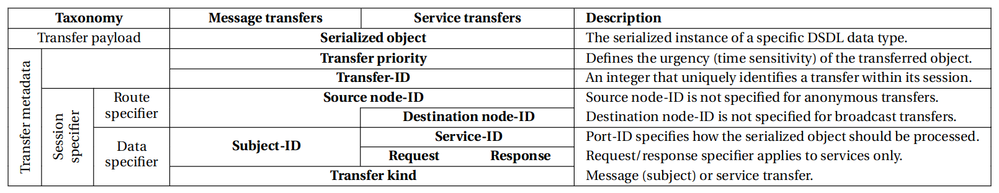

# LibCyphal design overview

LibCyphal is a high-level header-only wrapper over the existing Cyphal implementation libraries, such as LibCANard and LibUDPard (collectively referred to as lizards :lizard:), implemented in C++14 following high-integrity software development practices. It aims to be a full-featured implementation that comes with batteries included and is easy to integrate into any real-time application, from deeply embedded baremetal MCUs up to a conventional POSIX OS (such as GNU/Linux).

The library consists of several modules listed below.

**`libcyphal::transport`** abstracts the lizards via `ITransport` and provides glue logic between the lizards and the platform layer. At this layer, data is represented as serialized binary blobs rather than DSDL objects. There is a dedicated module per lizard, plus additional auxiliary modules:

- `libcyphal::transport::can` -- Cyphal/CAN-specific module and the platform layer abstractions.
- `libcyphal::transport::udp` -- Cyphal/UDP-specific module and the platform layer abstractions.
- more transport-specific modules may be added here, such as `serial` for Cyphal/serial.
- `libcyphal::transport::redundant` -- an aggregate over `ITransport` that builds a redundant Cyphal transport over a set of underlying instances of `ITransport`.
- `libcyphal::transport::commons` -- a collection of reusable components shared between different transports.

In certain minimal applications, the transport layer can be used directly, independently of the higher-level layers.

**`libcyphal::presentation`** is a layer on top of the transport layer that serves multiple purposes:

- Provides DSDL (de)serialization by invoking Nunavut-generated code appropriately. This provides a higher-level API for the user code that operates on DSDL objects instead of raw binary blobs.
- Demultiplexes incoming transfers across multiple consumers. This allows the application to instantiate multiple subscribers for a given subject simultaneously.
- Provides a convenient interface for invoking and serving RPC service calls.

**`libcyphal::application`** is a layer on top of the previous two that provides the top-level node-centric API for the application and implements some common functions of the protocol, such as the register interface, publication of heartbeats and port usage messages, and so on. This is where the included batteries can be found. Unlike the lower layers, the application layer depends on the code generated by Nunavut from certain standard DSDL definitions.

## General considerations

### Design principles

The design makes heavy use of type erasure to facilitate modularity and low coupling. This often requires the use of a heap, which is done via polymorphic memory resources without explicit dependency on the global new/delete heap. Non-heap polymorphism is implemented through `ImplementationCell<>` as described in section titled `DynamicBuffer` below.

## Transport layer

### Overview

```mermaid height=207,auto
classDiagram
%% ERROR MODEL
class Error {<<variant>>}
Error -- StateError
Error -- AnonymousError
Error -- ArgumentError
Error -- MemoryError
Error -- CapacityError
Error -- PlatformError
class PlatformError {
    +code: u32
}

class ProtocolParameters {
    +transfer_id_modulo: u64
    +max_nodes: u16
    +mtu: u32
}

%% RUNNABLE
class IRunnable {
    <<interface>>
    +run(now: TimePoint, poll_set: IPollSet&)
}

%% DYNAMIC BUFFER
class DynamicBuffer {
    +copy(offset: std::size_t, destination: void*, size_bytes: std::size_t) std::size_t
}

%% TRANSFERS
class TransferMetadata {
    +timestamp: Timestamp
    +priority: Priority
    +transfer_id: u64
}
class ServiceTransferMetadata {
    +remote_node_id: u16
}
TransferMetadata <|-- ServiceTransferMetadata
class MessageRxTransfer {
    +meta: TransferMetadata
    +publisher_node_id: cetl::optional~u16~
    +payload: DynamicBuffer
}
TransferMetadata o-- MessageRxTransfer
class ServiceRxTransfer {
    +meta: ServiceTransferMetadata
    +payload: DynamicBuffer
}
ServiceTransferMetadata o-- ServiceRxTransfer

%% SESSIONS
class ISession {
    <<interface>>
}
IRunnable <|-- ISession
class IMessageRxSession {
    <<interface>>
    +receive() MessageRxTransfer
    +getParams() MessageRxSessionParams
    +setTransferIDTimeout(timeout: Duration)
}
ISession <|-- IMessageRxSession
class IMessageTxSession {
    <<interface>>
    +send(meta: TransferMetadata, payload_fragments: cetl::span<cetl::span<byte>>) cetl::optional~Error~
    +getParams() MessageTxSessionParams
}
ISession <|-- IMessageTxSession
class IRequestRxSession {
    <<interface>>
    +receive() ServiceRxTransfer
    +getParams() RequestRxSessionParams
    +setTransferIDTimeout(timeout: Duration)
}
ISession <|-- IRequestRxSession
class IRequestTxSession {
    <<interface>>
    +send(meta: TransferMetadata, payload_fragments: cetl::span<cetl::span<byte>>) cetl::optional~Error~
    +getParams() RequestTxSessionParams
}
ISession <|-- IRequestTxSession
class IResponseRxSession {
    <<interface>>
    +receive() ServiceRxTransfer
    +getParams() ResponseRxSessionParams
    +setTransferIDTimeout(timeout: Duration)
}
ISession <|-- IResponseRxSession
class IResponseTxSession {
    <<interface>>
    +send(meta: ServiceTransferMetadata, payload_fragments: cetl::span<cetl::span<byte>>) cetl::optional~Error~
    +getParams() ResponseTxSessionParams
}
ISession <|-- IResponseTxSession

class MessageRxSessionParams {
    +subject_id: u16
    +extent_bytes: std::size_t
    +transfer_id_timeout: Duration
    +buffer_size: std::size_t
}
class MessageTxSessionParams {
    +subject_id: u16
}

class RequestRxSessionParams {
    +service_id: u16
    +extent_bytes: std::size_t
    +transfer_id_timeout: Duration
    +buffer_size: std::size_t
}
class RequestTxSessionParams {
    +service_id: u16
    +server_node_id: u16
}

class ResponseRxSessionParams {
    +service_id: u16
    +server_node_id: u16
    +extent_bytes: std::size_t
    +transfer_id_timeout: Duration
    +buffer_size: std::size_t
}
class ResponseTxSessionParams {
    +service_id: u16
}

class View~T~ {
    +begin() T
    +end() T
    +cbegin() const T
    +cend() const T
    -begin
    -end
}

%% TRANSPORT INTERFACE
class ITransport {
    <<interface>>
    +getLocalNodeID() cetl::optional~u16~
    +getProtocolParameters() ProtocolParameters

    +makeMessageRxSession(params: MessageRxSessionParams) cetl::expected#60;UniquePtr~IMessageRxSession~,Error#62;
    +makeMessageTxSession(params: MessageTxSessionParams) cetl::expected#60;UniquePtr~IMessageTxSession~,Error#62;

    +makeRequestRxSession(params: RequestRxSessionParams) cetl::expected#60;UniquePtr~IRequestRxSession~,Error#62;
    +makeRequestTxSession(params: RequestTxSessionParams) cetl::expected#60;UniquePtr~IRequestTxSession~,Error#62;

    +makeResponseRxSession(params: ResponseRxSessionParams) cetl::expected#60;UniquePtr~IResponseRxSession~,Error#62;
    +makeResponseTxSession(params: ResponseTxSessionParams) cetl::expected#60;UniquePtr~IResponseTxSession~,Error#62;

    +viewMessageRxSessions() View~MessageRxSessionIterator~
    +viewMessageTxSessions() View~MessageTxSessionIterator~

    +viewRequestRxSessions() View~RequestRxSessionIterator~
    +viewRequestTxSessions() View~RequestTxSessionIterator~

    +viewResponseRxSessions() View~ResponseRxSessionIterator~
    +viewResponseTxSessions() View~ResponseTxSessionIterator~
}
IRunnable <|-- ITransport
IMessageRxSession o-- ITransport
IMessageTxSession o-- ITransport
IRequestRxSession o-- ITransport
IRequestTxSession o-- ITransport
IResponseRxSession o-- ITransport
IResponseTxSession o-- ITransport
```



#### Execution flow and the runner interface

The execution flow is modeled after this proposal: https://forum.opencyphal.org/t/design-review-execution-model-for-libcyphal/1918. The entire LibCyphal API is non-blocking. Some methods may schedule operations to be performed asynchronously, e.g., enqueue data to transmit; such scheduled operations are executed in the background through periodic servicing via the `IRunnable` interface, which provides method `IRunnable::run(const TimePoint now, IPollSet& poll_set)`.

Per the referenced proposal, basic baremetal systems may invoke `IRunnable::run` at a fixed (high) rate without IO blocking/multiplexing, while more sophisticated multi-process systems may minimize the polling rate by waiting for the relevant file descriptors to become ready; the set of the file descriptors of interest is communicated to the entity responsible for calling the `run` method via `IPollSet` described below. Theoretically, multi-threaded systems may run one `IRunnable` per thread to minimize contention and overhead, albeit this will require additional locking inside the library; at the moment, this usage scenario is not yet supported.

The `IPollSet` provides the ability for a runnable item to specify a platform resource it is blocked on. This allows the external layers to suspend execution of the thread managing the current `IRunnable` (or set thereof) after the last call to `run` until the underlying resource is ready to be handled. The poll set is defined approximately as follows:

```c++
class IPollSet
{
public:
    virtual void input(const std::uint32_t fd) = 0;   ///< Block until the fd is readable.
    virtual void output(const std::uint32_t fd) = 0;  ///< Block until the fd is writeable.
    virtual void deadline(const TimePoint deadline) = 0;  ///< Block untli deadline.
    // rule of 5...
};
```

An alternative, more flexible definition that avoids assumptions about the type of the file descriptors at the expense of type safety is as follows (this is usable with non-POSIX-like IO mux APIs):

```c++
class IPollSet
{
public:
    virtual void input(void* const resource) = 0;   ///< Block until the resource is readable.
    virtual void output(void* const resource) = 0;  ///< Block until the resource is writeable.
    virtual void deadline(const TimePoint deadline) = 0;  ///< Block untli deadline.
    // rule of 5...
};
```

The reference to `IPollSet` passed via `run` is not guaranteed to retain validity after `run` is finished.
Thus, implementations are **not allowed** to store the reference internally.

The set of file descriptors and timeouts is reconstructed from scratch after every call to `run`. This approach has the advantage of being stateless and thus easy to model and verify, as there is no state that survives from one `run` to another. The disadvantages to be aware of are as follows:

1. A newly introduced readable file descriptor will only appear in the poll set after the next `run`; this implies that once the application registered its interest in a particular data source (e.g., a subscription), it may not read data from it until next `run`. This can be addressed by forcing a certain maximum polling period.
2. High-performance I/O multiplexing mechanisms that store the set of file descriptors in the kernel space (e.g., `epoll`, `kqueue`) are not well-suited for this design, as they would necessitate multiple system calls per `run` just to keep the list of FDs up to date. Traditional `poll` or `select` should be used instead.
3. In multi-threaded environments, a file descriptor may be closed while an IO mux call is blocked on it. This case is usually managed predictably by known IO mux functions.

The need to manage multiple `IRunner` instances in a single thread is expected to arise often, even in multi-threaded environments. For this, we introduce an aggregate that implements `IRunnable` itself (to enhance composability) and provides methods for registering and unregistering underlying `IRunnable` instances:

```c++
template <std::size_t Capacity>
class AggregateRunnable final : public IRunnable
{
public:
    /// Invokes run() on all members in the order of their addition.
    void run(const TimePoint now, IPollSet& poll_set) override;
    /// Returns true on success, false if the capacity is exhausted.
    [[nodiscard]] bool add(IRunnable& inferior);
    /// Returns true if such inferior was found and removed, false if not found.
    [[nodiscard]] bool remove(IRunnable& inferior);
};
```

#### Session factory methods

Sessions are introduced in the Cyphal Specification as a key part of the transport layer model:



In LibCyphal, session objects represent data flows parameterized in a slightly unorthodox way:

* Message-Rx and Tx sessions are parameterized with the subject-ID.
* Request-Rx and Response-Tx sessions are parameterized with the service-ID.
* Response-Rx and Request-Tx sessions are parameterized with the service-ID and the remote node-ID.

The treatment of Request-Rx and Response-Tx sessions differs from the strict model proposed in the Specification to match the intended usage pattern of the library. Request-Rx and Response-Tx sessions are used by RPC servers, which are agnostic of the identity of the remote node issuing a request, and thus, an RPC server must be able to accept an incoming request from any remote node and send a response back to any node.

The Response-Rx and Request-Tx sessions match the model proposed in the Specification; the higher-level RPC client API is built on the assumption that the user obtains an instance of the client per remote node-ID per service-ID.

While it is possible to return type-erased entities implementing a specific interface by value (as will be shown later), this approach cannot be used for sessions because lizards typically require entities used for the implementation of sessions to be pinned in memory. The session factory methods therefore return PMR-allocated objects via unique pointers. Transport implementations will necessarily have to be aware of the full set of sessions extant at any moment; for this, internally, sessions are kept arranged in containers such as linked lists or AVL trees (see [Cavl](https://github.com/pavel-kirienko/cavl)). Session destructors (invoked when the unique pointer is destroyed) are used to delist the destroyed element from the internal containers and perform other activities associated with the removal of a session, such as closing UDP sockets, etc.

Session view methods such as `ITransport::viewMessageRxSessions` provide a view into the internal containers holding the active sessions via begin/end iterators. Conventionally, iterators are manipulated by value, and yet their behavior is highly transport-specific because they have to access the internal container of sessions, which calls for polymorphism. To address this, we define a polymorphic iterator interface and return iterators by value wrapped into `ImplementationCell<>` introduced below. It is assumed that the application will not attempt to mutate the set of sessions while iteration is in progress.

#### `DynamicBuffer`

Lizards operate on raw serialized binary blobs of data rather than high-level message representations. Transmission is performed by enqueueing serialized transfers into a private transmission queue managed by the lizard, which is easy to abstract from the application. Reception is a more complicated case because it requires a lizard to return memory to the application that is owned by the lizard, requiring the latter to free it after use in a lizard-specific manner; further and more importantly, such memory may or may not be fragmented in a gather-scatter buffer. To hide the specifics of such memory management from the application, a new abstraction is introduced, represented by the class named `DynamicBuffer`.

Examples of lizard-specific management of the returned memory can be found in
<https://github.com/OpenCyphal/libcanard/blob/73d0a9cae94307038344b0d3eac2fd6dac44e139/libcanard/canard.h#L335-L338> and
<https://github.com/OpenCyphal/libudpard/blob/417d92cf9779e28c7b96bebba41665874cc13ad0/libudpard/udpard.h#L285-L311>.

The `DynamicBuffer` provides a uniform API for dealing with the Cyphal transfer payload returned by a lizard and also implements the movable/non-copyable RAII semantics for freeing the memory allocated for the buffer once the dynamic buffer instance is disposed of. The interface hides the gather-scatter nature of the buffer, providing a simplified linearized view. The definition of the class is approximately as follows:

```c++
/// The buffer is movable but not copyable because copying the contents of a buffer is considered wasteful.
/// The buffer behaves as if it's empty if the underlying implementation is moved away.
class DynamicBuffer final
{
public:
    static constexpr std::size_t ImplementationFootprint = sizeof(void*) * 8;

    class Iface  /// Lizard-specific implementation hidden from the user.
    {
    public:
        [[nodiscard]] virtual std::size_t copy(const std::size_t offset_bytes,
                                               void* const destination,
                                               const std::size_t length_bytes) const = 0;
        [[nodiscard]] virtual std::size_t size() const = 0;
        Iface()                        = default;
        Iface(const Iface&)            = delete;
        Iface(Iface&&)                 = default;
        Iface& operator=(const Iface&) = delete;
        Iface& operator=(Iface&&)      = delete;
        virtual ~Iface()               = default;
    };

    /// Accepts a Lizard-specific implementation of Iface and moves it into the internal storage.
    template<typename T, typename = std::enable_if_t<std::is_base_of<Iface, T>::value>>
    explicit DynamicBuffer(T&& source) : impl_(std::move(source)) {}

    /// Copies a fragment of the specified size at the specified offset out of the buffer.
    /// The request is truncated to prevent out-of-range memory access.
    /// Returns the number of bytes copied.
    /// Does nothing and returns zero if the instance has been moved away.
    [[nodiscard]] std::size_t copy(const std::size_t offset_bytes, void* const destination, const std::size_t length_bytes) const
    {
        return impl_ ? impl_->copy(offset_bytes, destination, length_bytes) : 0;
    }
    /// The number of bytes stored in the buffer (possibly scattered, but this is hidden from the user).
    /// Returns zero if the buffer is moved away.
    [[nodiscard]] std::size_t size() const { return impl_ ? impl_->size() : 0; }

private:
    ImplementationCell<Iface, ImplementationFootprint> impl_;
};
```

The lizard-specific implementation is stored (i.e., allocated) in the `ImplementationCell` class template:

```c++
/// The instance is always initialized with a valid value, but it may turn valueless if the value is moved.
template <typename Iface, std::size_t Footprint>
class ImplementationCell final
{
public:
    template<typename Impl, typename = std::enable_if_t<std::is_base_of<Iface, Impl>::value>>
    explicit ImplementationCell(Impl&& object) : storage_(std::forward<Impl>(object)) {}

    template <typename Impl, typename... Args>
    std::enable_if_t<std::is_base_of<Iface, Impl>::value> emplace(Args&&... as)
    { storage_.template emplace<Impl>(std::forward<Args>(as)...); }

    [[nodiscard]]       Iface* operator->()       { return &storage_.template reinterpret<Iface>(); }
    [[nodiscard]] const Iface* operator->() const { return &storage_.template reinterpret<Iface>(); }

    [[nodiscard]] operator bool() const { return storage_.has_value(); }

private:
    UniqueAny<Footprint> storage_;
};
```

The most important component here is `UniqueAny<Footprint>`, which is similar to `std::any` except for the following details:

- The entirety of the contained object is stored within an arena inside `UniqueAny`. The size of the arena is specified as a non-type template parameter. Compile-time checks are provided to ensure that the arena is large enough to contain the object.
- The contained entity does not need to be copyable, but it has to be movable. `UniqueAny` relies on moving exclusively, unlike `std::any`, which employs copying. This allows efficient usage of this class for buffer memory management.
- RTTI is not used; instead, it is the responsibility of the user to ensure that only viable type conversions are performed. This does not introduce risks of API misuse because the required checks are performed by the wrapping class `ImplementationCell` introduced above.

An original implementation of `UniqueAny<>` is available at https://godbolt.org/z/79EhzboYP.

As a side note, one can sometimes see a technique similar to the following used to substitute for the lack of RTTI:

```c++
template <typename T>
struct TypeID final
{
public:
    static void* get()
    {
        static TypeID obj;
        return &obj;
    }
private:
    TypeID() = default;
};
```

The idea is that  `TypeID<T>::get()` has distinct results over T. This approach is used in the glibcpp implementation of `std::any`; however, AFAIK, this is not guaranteed to perform correctly per the C++ standard because it is possible that `TypeID<T>::get() != TypeID<T>::get()` when used from different translation units.

### Cyphal/CAN

The Cyphal/CAN transport is underpinned by the following non-blocking media layer API that operates on extended CAN frames (either Classic CAN or CAN FD):

```c++
/// The IRunnable interface allows the higher layers to retrieve the IO descriptors for polling.
class IMedia : public IRunnable
{
public:
    /// This value is constant after initialization.
    [[nodiscard]] virtual std::uint16_t getMTU() const noexcept = 0;

    /// If there are fewer hardware filters available than requested, the configuration will be coalesced as described
    /// in the Cyphal/CAN Specification. If there are zero filters requested, all incoming traffic will be rejected.
    /// While reconfiguration is in progress, incoming frames may be lost and/or unwanted frames may be received.
    /// The lifetime of the filter array may end upon return (no references retained).
    /// Returns true on success, false in case of a low-level error (e.g., IO error).
    struct Filter final { std::uint32_t id; std::uint32_t mask; };
    [[nodiscard]] virtual bool setFilters(const std::span<const Filter> id_mask) noexcept = 0;

    /// Schedule the frame for transmission asynchronously and return immediately.
    /// Returns true if accepted or already timed out; false to try again later.
    [[nodiscard]] virtual std::expected<bool, std::variant<ArgumentError>> push(const TimePoint                  deadline,
                                                                                const std::uint32_t              can_id,
                                                                                const std::span<const std::byte> payload) noexcept = 0;

    /// Return the next frame from the reception queue unless empty; otherwise, return an empty option immediately.
    /// The payload of the frame will be written into the span.
    struct Rx final { TimePoint timestamp; std::uint32_t extended_can_id; std::size_t payload_size; };
    [[nodiscard]] virtual std::optional<Rx> pop(const std::span<std::byte> payload_buffer) noexcept = 0;
};
```

Class `CANTransport` implements `ITransport` for Cyphal/CAN. It is constructed using the following static factory that returns the non-copyable instance by value relying on RVO:

```c++
/// A CANTransport supports at most this many redundant media layer instances. The minimum is 1.
static constexpr std::uint8_t MaxRedundancyFactor = 3;

/// The pmr and media references must outlive the transport. The call does not allocate memory.
/// Passing more than one media enables homogeneous interface redundancy.
/// The transport is responsible for servicing the IRunnable of IMedia, the caller need not do that.
/// To change the node-ID, a new transport has to be created.
[[nodiscard]] inline
std::expected<CANTransport, std::variant<ArgumentError>>
makeCANTransport(std::pmr::memory_resource&         memory,
                 const std::span<IMedia&>           media,
                 const std::optional<std::uint16_t> local_node_id);
```

The CAN transport supports homogeneous redundancy; it can be combined with heterogeneous redundancy with the help of `libcyphal::transport::redundant`.

### Cyphal/UDP

Just like Cyphal/CAN, Cyphal/UDP also supports inner homogeneous redundancy, and it can be combined with `libcyphal::transport::redundant` for heterogeneous redundancy. Unlike Cyphal/CAN, Cyphal/UDP needs dynamic instantiation of sockets depending on the requested Cyphal port configuration, so a socket factory interface is defined:

```c++
/// Most socket APIs (like Berkeley) will also require the local iface address to be specified.
/// This is to be done by the implementation, outside of this interface.
/// All sockets operate only on multicast data.
/// The sockets produced by this interface shall not outlive it.
class IMedia
{
public:
    /// LibUDPard requires only one Tx socket per iface.
    /// We could construct one statically and pass it over during transport initialization,
    /// but that would be poorly compatible with listen-only nodes that are not interested in sending
    /// any transfers, as they require no Tx sockets at all.
    virtual [[nodiscard]]
    std::expected<UniquePtr<ITxSocket>,
                  std::variant<MemoryError, PlatformError>>
    makeTxSocket() = 0;

    /// Construct a new socket bound to the specified multicast group endpoint.
    virtual [[nodiscard]]
    std::expected<UniquePtr<IRxSocket>,
                  std::variant<MemoryError, PlatformError, ArgumentError>>
    makeRxSocket(const UDPIPEndpoint& multicast_endpoint) = 0;
};
```

If `ITxSocket::send` returns false indicating that the socket is not ready to accept writes, the implementation would normally register this ocurrence internally and then register the socket's file descriptor for writing via `IPollSet::output` at the next `IRunnable::run`. This behavior ensures that write polling will only be performed if there are pending transmissions. One potential limitation to be aware of is that in the following call sequence, the pending transmission becomes delayed by one `run` cycle:

- Initially, no pending transmission is registered (no data to send).
- `run` is called, no pending transmission is registered so `output` is not called.
- `send` is called and the socket is found to be not ready to accept writes. Output polling is needed.
- The main loop is blocked on IO until the next `run` service cycle. However, the IO multiplexor is unaware of the fact that there is data waiting to be sent, which results in an unnecessary transmission delay.

```c++
/// The IRunnable interface allows the higher layers to retrieve the IO descriptors for polling.
class ITxSocket : public IRunnable
{
public:
    /// Returns true if the frame has been accepted successfully, false if the socket is not ready for writing.
    virtual [[nodiscard]] std::expected<bool, std::variant<PlatformError, ArgumentError>>
    send(const UDPIPEndpoint&             multicast_endpoint,
         const std::uint8_t               dscp,
         const std::span<const std::byte> payload) = 0;

    /// This is the Cyphal-layer MTU, which is the maximum number of payload bytes per Cyphal frame.
    /// To guarantee a single frame transfer, the maximum payload size shall be 4 bytes less to accommodate the CRC.
    /// The MTU is set per Tx socket individually and it must remain constant after initialization.
    virtual [[nodiscard]] std::size_t getMTU() const { return DefaultMTU; }

    /// The default MTU is derived as:
    ///     1500B Ethernet MTU (RFC 894) - 60B IPv4 max header - 8B UDP Header - 24B Cyphal header
    static constexpr std::size_t DefaultMTU = 1408U;
};
```

```c++
/// The IRunnable interface allows the higher layers to retrieve the IO descriptors for polling.
class IRxSocket : public IRunnable
{
public:
    /// Returns the size of the payload received, or an empty option if the socket is not readable.
    virtual [[nodiscard]] std::expected<std::optional<std::size_t>, std::variant<PlatformError, ArgumentError>>
    receive(const std::span<std::byte> payload_buffer) = 0;
};
```

Class `UDPTransport` implements `ITransport` for Cyphal/UDP. It is constructed using the following static factory that returns the non-copyable instance by value relying on RVO:

```c++
/// A UDPTransport supports at most this many redundant media layer instances. The minimum is 1.
static constexpr std::uint8_t MaxRedundancyFactor = 3;

/// The pmr and media references must outlive the transport. The call does not allocate memory.
/// Passing more than one media enables homogeneous interface redundancy.
/// The transport is responsible for servicing the IRunnable of IMedia, the caller need not do that.
/// To change the node-ID, a new transport has to be created.
[[nodiscard]] inline
std::expected<UDPTransport, std::variant<ArgumentError>>
makeUDPTransport(std::pmr::memory_resource&         memory,
                 const std::span<IMedia&>           media,
                 const std::optional<std::uint16_t> local_node_id);
```

### Heterogeneous redundancy

The redundant transport module can aggregate multiple underlying instances of `ITransport` to provide transfer-level redundancy (as opposed to frame-level redundancy; see the Specification for the background) transparently for the application. This includes the ability to aggregate distinct transport types, such as UDP and serial. The design closely follows [`pycyphal.transport.redundant.RedundantTransport`](https://pycyphal.readthedocs.io/en/stable/api/pycyphal.transport.redundant.html#pycyphal.transport.redundant.RedundantTransport).

This implementation uses the term inferior to refer to a member of a redundant group:

* Inferior transport is a transport that belongs to a redundant transport group.
* Inferior session is a transport session that is owned by an inferior transport.

A redundant transport session holds a set of inferior sessions, one from each inferior transport, all sharing the same session specifier (e.g., same subject-ID). The resulting relationship between inferior transports and inferior sessions can be conceptualized as a matrix where columns represent inferior transports and rows represent sessions:

. | Transport 0 | Transport 1 | ... | Transport M
----------|------|------|-----|------
Session 0 | S0T0 | S0T1 | ... | S0Tm
Session 1 | S1T0 | S1T1 | ... | S1Tm
...       | ...  | ...  | ... | ...
Session N | SnT0 | SnT1 | ... | SnTm

Attachment/detachment of a transport is an addition/removal of a column; likewise, construction/retirement of a session is an addition/removal of a row. While the construction of a row or a column is in progress, the matrix resides in an inconsistent state. If any error occurs in the process, the matrix is rolled back to the previous consistent state, and the already-constructed sessions of the new vector are retired.

Existing redundant sessions retain validity across any changes in the matrix configuration. Logic that relies on a redundant instance is completely shielded from any changes in the underlying transport configuration, meaning that the entire underlying transport structure may be swapped out with a completely different one without affecting the higher levels. A practical extreme case is where a redundant transport is constructed with zero inferior transports, its session instances are configured, and the inferior transports are added later. This is expected to be useful for long-running applications that have to retain the presentation-level structure across changes in the transport configuration done on-the-fly without stopping the application.

The redundant transport replicates every outgoing transfer into all of the available redundant interfaces. Transmission operates at the rate of the best-performing inferior; transmission is assumed to be successful if at least one transport is able to complete it.

Incoming transfers are deduplicated so that the local node receives at most one copy of each unique transfer received from the bus.

## Presentation layer

To be continued.

## Application layer

To be continued.
