# LibCyphal design overview

LibCyphal is a high-level header-only wrapper over the existing Cyphal implementation libraries, such as LibCANard and LibUDPard (collectively referred to as lizards :lizard:), implemented in C++14 following high-integrity software development practices. It aims to be a full-featured implementation that comes with batteries included and is easy to integrate into any real-time application, from deeply embedded baremetal MCUs up to a conventional POSIX OS (such as GNU/Linux). However, targets with strict memory constraints (such as low-end MCUs with less than ~100k of RAM) are intentionally excluded from the list of intended applications; for those, one should pick a lizard and use it directly.

The design specification given in this document provides only a high-level, broad-strokes overview of the library's API and features. Minor inconsistencies and incompleteness are expected.

The library consists of several modules listed below.

**`libcyphal::transport`** abstracts the lizards via `ITransport` and provides glue logic between the lizards and the platform layer. At this layer, data is represented as serialized binary blobs rather than DSDL objects. There is a dedicated module per lizard, plus additional auxiliary modules:

- `libcyphal::transport::can` -- Cyphal/CAN-specific module and the platform layer abstractions.
- `libcyphal::transport::udp` -- Cyphal/UDP-specific module and the platform layer abstractions.
- more transport-specific modules may be added here, such as `serial` for Cyphal/serial.
- `libcyphal::transport::redundant` -- an aggregate over `ITransport` that builds a redundant Cyphal transport over a set of underlying instances of `ITransport`.
- `libcyphal::transport::commons` -- a collection of reusable components shared between different transports.

In certain minimal applications, the transport layer can be used directly, independently of the higher-level layers.

**`libcyphal::presentation`** is a layer on top of the transport layer that serves multiple purposes:

- Provides DSDL (de)serialization by invoking Nunavut-generated code appropriately. This provides a higher-level API for the user code that operates on DSDL objects instead of raw binary blobs.
- Demultiplexes incoming transfers across multiple consumers. This allows the application to instantiate multiple subscribers for a given subject simultaneously.
- Provides a convenient interface for invoking and serving RPC service calls.

**`libcyphal::application`** is a layer on top of the previous two that provides the top-level node-centric API for the application and implements some common functions of the protocol, such as the register interface, publication of heartbeats and port usage messages, and so on. This is where the included batteries can be found. Unlike the lower layers, the application layer depends on the code generated by Nunavut from certain standard DSDL definitions.

## General considerations

### Design principles

Exceptions are not leveraged by the library itself, but it is designed to be exception-aware, allowing its integration into applications that make use of exception handling.

Runtime type identification is not required; a substitute is provided through the CETL library. The objective is to eliminate the dependency on the opaque compiler-generated code and avoid unspecified-complexity operations at runtime.

Usage of the heap is reduced to the bare minimum and is done strictly via polymorphic memory resources without any reliance on the global heap. Most allocations are done once during initialization; with the exceptions listed below, the library will not perform further allocations at runtime unless the application needs to change its port configuration (i.e., subscriptions/publications/RPC) dynamically at runtime, which is rarely seen in embedded real-time systems. The exceptions to the no-memory-allocation policy are as follows:

- Transport-layer queues and memory reassembly buffers allocated at runtime by the lizards. The memory usage patterns and limits of the lizards are very well formalized in the documentation; further, certain lizards allow the replacement of heap allocators with block pool allocators.

Type erasure is used throughout to reduce coupling and uphold encapsulation. In some cases, heap allocation that is often associated with type erasure is avoided with the help of small-object-optimized containers that provide an internal arena to store the type-erased object within. More on this below.

Unconventionally, dynamic typing is leveraged with care in certain platform-specific contexts to uphold encapsulation.

### RTTI and dynamic linking considerations

As will be seen later, certain design features are dependent on the ability to detect identical types at runtime, yet the library must be usable without the RTTI capability of the C++ runtime.

#### First proposal: Static address based type identification (REJECTED)

The following construct is used to provide a small subset of RTTI features that happens to be sufficient for the needs of the library:

```c++
/// A simplified substitute for RTTI that allows querying the identity of types.
/// Returns an object of an unspecified type for which operator== and operator!= are defined.
/// Objects for the same type compare equal. Ordering is not defined.
template <typename>
auto getTypeID() noexcept
{
    static const struct {} placeholder{};
    return static_cast<const void*>(&placeholder);
}
using TypeID = decltype(getTypeID<void>());
```

Per the C++ standard, the address of a local variable with a `static` storage specifier defined in an `inline` function is guaranteed to be the same across all translation units:

>C++98, 7.1.2.4: An `inline function` with external linkage shall have the same address in all translation units. A `static` local variable in an `extern inline` function always refers to the same object. A string literal in an `extern inline` function is the same object in different translation units.

>Latest draft, 9.2.8.6: An `inline` function or variable with external or module linkage can be defined in multiple translation units (6.3), but is one entity with one address. A type or `static` variable defined in the body of such a function is therefore a single entity.

These provisions guarantee that `getTypeID` will perform as intended within the scope of a given executable; however, one should not overlook the fact that dynamic linking renders this solution dysfunctional, as a dynamically linked shared object file may contain instantiations of `getTypeID` for a given type that duplicate those available in the host executable or another shared object. The following example demonstrates the problem:

```c++
// Compile the executable with: c++ main.c++ -std=c++14
#include "typeid.hpp"  // this header contains getTypeID
#include <dlfcn.h>
#include <iostream>
int main()
{
    std::cout << getTypeID<void>() << std::endl;
    std::cout << getTypeID<long double>() << std::endl;
    reinterpret_cast<void(*)()>(dlsym(dlopen("liblib.so", RTLD_LAZY), "execute"))();
    return 0;
}
```

```c++
// Compile this file into a shared object as follows: c++ -shared -fPIC -o liblib.so lib.c++
#include "typeid.hpp"  // this header contains getTypeID
#include <iostream>
extern "C" void execute()
{
    std::cout << getTypeID<float>() << std::endl;
    std::cout << getTypeID<int>() << std::endl;
    std::cout << getTypeID<long double>() << std::endl;
    std::cout << getTypeID<void>() << std::endl;
}
```

Execution yields the following output (with annotations on the right):

```
0x555a3f298004  <- void
0x555a3f29801b  <- long double
0x7f4b30a77001
0x7f4b30a77002
0x7f4b30a77003  <- long double
0x7f4b30a77000  <- void
```

Forcing link-time linking of the shared object by adding `-L. -llib`, we observe a different result where `getTypeID` operates correctly:

```
0x55c1ae4cd017  <- void
0x55c1ae4cd016  <- long double
0x7f8d211ef001
0x7f8d211ef002
0x55c1ae4cd016  <- long double
0x55c1ae4cd017  <- void
```

Hence, one recognized limitation of this design is that the library *may* require RTTI support if it is to be used across dynamically linked shared objects. In that case, `getTypeID` becomes a trivial wrapper over `typeid`:

```c++
#if defined(LIBCYPHAL_USE_RTTI) && LIBCYPHAL_USE_RTTI
#include <typeinfo>
template <typename T>
const auto& getTypeID() noexcept
{
    return typeid(T);
}
#else
// ... alternative implementation ...
#endif
```

It is worth noting that the same (in essence) approach is used for runtime type identification in the implementation of `std::any` from glibc.

It is desirable to move `getTypeID` into Cetl to simplify its reuse between different components, such as LibCyphal and Nunavut-generated types.

#### Second proposal: UUID (ACCEPTED)

Use manually-assigned UUID for type identification exposed via a dedicated virtual method as described here: <https://github.com/OpenCyphal/CETL/issues/51>. Said method will be referred to as `_type_()` in the rest of this document.

### Safe dynamic type conversion without RTTI

In the interest of minimizing the deviations from relevant high-integrity software design guidelines, the dependency on metaprogramming is reduced to the bare minimum. As will be seen later, this choice requires some form of runtime type identification and dynamic casting to support the handling of DSDL objects. Without the full RTTI support, one cannot rely on the built-in `dynamic_cast` conversion; this can be worked around with a simplified version presented below that makes use of the RTTI substitutes introduced earlier:

```c++
/// Returns a converted pointer if the type of the operand is Target and the operand is not nullptr.
/// Otherwise, returns nullptr.
/// The type of the operand shall implement ._type_() const noexcept -> TypeID.
/// We use "_type_" instead of "type" to avoid name collisions with DSDL-generated types.
template <typename Target,
          typename Iface,
          typename = std::enable_if_t<std::is_base_of<Iface, Target>::value>,  // This constraint is optional.
          typename = std::enable_if_t<std::is_same_v<TypeID, decltype(std::declval<Iface>()._type_())>>>
[[nodiscard]] Target* strict_dynamic_cast(Iface* const operand) noexcept
{
    if ((operand != nullptr) && (operand->_type_() == getTypeID<std::decay_t<Target>>()))
    {
        return static_cast<Target*>(operand);
    }
    return nullptr;
}
```

### Error handling

With the C++ exceptions being avoided on purpose, the library heavily utilizes algebraic types for error handling. A class similar to `std::expected` is expected to be available in CETL for this purpose. Aside from that, `std::variant` or its CETL alternative is used to hold one of the possible error states, where each state has a distinct type that is possibly parameterized with error-kind-specific information (such as `errno` value for platform-related errors, etc).

This approach to error handling causes one particular task to occur often: the list of possible error states held in a `std::variant` often needs to be amended with additional states by functions located higher up the call stack. To address this, we introduce the following helper:

```c++
namespace detail
{
template <typename T, typename... Args>
struct AppendType;
template <typename... A, typename... B>
struct AppendType<std::variant<A...>, B...>
{
    using Result = std::variant<A..., B...>;
};
// Further specializations for std::tuple<> etc may be added as needed.
}  // namespace detail

/// Usage:
///     using NewVariant = AppendType<OldVariant, NewAlternative1, NewAlternative2>
template <typename T, typename... Args>
using AppendType = typename detail::AppendType<T, Args...>::Result;
```

### PMR-aware `cetl::any`

LibCyphal will depend on a PMR-aware reimplementation of `std::any` provided by CETL, referred to as `cetl::any`. Optional small-object optimization may also be implemented to reduce the reliance on PMR-provided memory.

To facilitate handling of expensive-to-copy or non-copyable objects such as memory buffers, this implementation of `any` should rely on moving instead of copying where possible.

Unlike `std::any`, this custom class does not make use of RTTI, relying on the RTTI substitute introduced earlier instead.

This type enables dynamic typing with runtime type safety checking, which is used to facilitate certain design options introduced later.

### Type erasure without pointers

Article [Inheritance Without Pointers](https://www.fluentcpp.com/2021/01/29/inheritance-without-pointers/) provides an interesting approach to implementing type erasure without heap based on `std::any`. LibCyphal makes use of `cetl::any` to the same end. The resulting container type is defined as follows:

```c++
/// A generalized implementation of https://www.fluentcpp.com/2021/01/29/inheritance-without-pointers/
/// that works with any any.
/// The instance is always initialized with a valid value, but it may turn valueless if the value is moved.
/// The Any type can be either std::any or a custom alternative.
template <typename Iface, typename Any>
class ImplementationCell final
{
public:
    template<typename Impl, typename = std::enable_if_t<std::is_base_of<Iface, Impl>::value>>
    explicit ImplementationCell(Impl&& object) :
        storage_(std::forward<Impl>(object)),
        fn_getter_mut_([](Any& sto) -> Iface* { return any_cast<Impl>(&sto); }),
        fn_getter_const_([](const Any& sto) -> const Iface* { return any_cast<Impl>(&sto); })
    {}

    /// Behavior undefined if the instance is valueless.
    [[nodiscard]]       Iface* operator->()       { return fn_getter_mut_(storage_); }
    [[nodiscard]] const Iface* operator->() const { return fn_getter_const_(storage_); }

    [[nodiscard]] operator bool() const { return storage_.has_value(); }

private:
    Any storage_;
    Iface* (*fn_getter_mut_)(Any&);
    const Iface* (*fn_getter_const_)(const Any&);
};
```

### PMR-aware `cetl::function`

Similar to `cetl::any`, LibCyphal will require a custom heapless `cetl::function` that allocates the callable inside either a private arena or a PMR-provided buffer rather than the default heap.

### PMR-enabled `cetl::shared_ptr`

Certain parts of the presentation layer, possibly along with other parts of the library, will share certain PMR-allocated resources internally. While it is possible to implement reference counting ad-hoc, it is desirable to extract this concern into a separate entity, said entity being a PMR-aware shared pointer implementation. By "PMR-aware," we mean that the pointer takes a reference to `std::pmr::memory_resource` upon construction and uses that memory resource to allocate the reference counter instead of using the free store. Similarly, a `cetl::make_shared` factory is needed that takes a PMR reference in a similar fashion to allocate the reference counter in the same memory block with the shared object.

### Time primitives

The library makes use of `std::chrono` via the following adapter:

```c++
/// The internal time representation is in microseconds, which is in line with the lizards that use uint64_t-typed
/// microsecond counters throughout.
///
/// The now() method is NOT implemnted by the library; the user code is expected to provide a suitable implementation
/// instead depending on the requirements of the application. A possible implementation on a POSIX-like platform is:
///
///     MonotonicClock::time_point MonotonicClock::now() noexcept
///     { return std::chrono::time_point_cast<time_point>(std::chrono::steady_clock::now()); }
struct MonotonicClock final
{
    using rep        = std::int64_t;
    using period     = std::micro;
    using duration   = std::chrono::duration<rep, period>;
    using time_point = std::chrono::time_point<MonotonicClock>;

    [[maybe_unused]] static constexpr bool is_steady = true;

    [[nodiscard]] static time_point now() noexcept;
};
using TimePoint = MonotonicClock::time_point;
using Duration  = MonotonicClock::duration;
```

## Transport layer

### Overview

```mermaid height=207,auto
classDiagram
%% ERROR MODEL
class Error {<<variant>>}
Error -- StateError
Error -- AnonymousError
Error -- ArgumentError
Error -- MemoryError
Error -- CapacityError
Error -- PlatformError
class PlatformError {
    +code: u32
}

class ProtocolParameters {
    +transfer_id_modulo: u64
    +max_nodes: u16
    +mtu: u32
}

%% RUNNABLE
class IRunnable {
    <<interface>>
    +run(now: TimePoint)
}

%% DYNAMIC BUFFER
class DynamicBuffer {
    +copy(offset: std::size_t, destination: void*, size_bytes: std::size_t) std::size_t
}

%% TRANSFERS
class TransferMetadata {
    +timestamp: Timestamp
    +priority: Priority
    +transfer_id: u64
}
class ServiceTransferMetadata {
    +remote_node_id: u16
}
TransferMetadata <|-- ServiceTransferMetadata
class MessageRxTransfer {
    +meta: TransferMetadata
    +publisher_node_id: cetl::optional~u16~
    +payload: DynamicBuffer
}
TransferMetadata o-- MessageRxTransfer
class ServiceRxTransfer {
    +meta: ServiceTransferMetadata
    +payload: DynamicBuffer
}
ServiceTransferMetadata o-- ServiceRxTransfer

%% SESSIONS
class ISession {
    <<interface>>
}
IRunnable <|-- ISession
class IMessageRxSession {
    <<interface>>
    +receive() MessageRxTransfer
    +getParams() MessageRxSessionParams
    +setTransferIDTimeout(timeout: Duration)
}
ISession <|-- IMessageRxSession
class IMessageTxSession {
    <<interface>>
    +send(meta: TransferMetadata, payload_fragments: cetl::span#60;cetl::span~byte~#62;) cetl::optional~Error~
    +getParams() MessageTxSessionParams
}
ISession <|-- IMessageTxSession
class IRequestRxSession {
    <<interface>>
    +receive() ServiceRxTransfer
    +getParams() RequestRxSessionParams
    +setTransferIDTimeout(timeout: Duration)
}
ISession <|-- IRequestRxSession
class IRequestTxSession {
    <<interface>>
    +send(meta: TransferMetadata, payload_fragments: cetl::span#60;cetl::span~byte~#62;) cetl::optional~Error~
    +getParams() RequestTxSessionParams
}
ISession <|-- IRequestTxSession
class IResponseRxSession {
    <<interface>>
    +receive() ServiceRxTransfer
    +getParams() ResponseRxSessionParams
    +setTransferIDTimeout(timeout: Duration)
}
ISession <|-- IResponseRxSession
class IResponseTxSession {
    <<interface>>
    +send(meta: ServiceTransferMetadata, payload_fragments: cetl::span#60;cetl::span~byte~#62;) cetl::optional~Error~
    +getParams() ResponseTxSessionParams
}
ISession <|-- IResponseTxSession

class MessageRxSessionParams {
    +subject_id: u16
    +extent_bytes: std::size_t
}
class MessageTxSessionParams {
    +subject_id: u16
}

class RequestRxSessionParams {
    +service_id: u16
    +extent_bytes: std::size_t
}
class RequestTxSessionParams {
    +service_id: u16
    +server_node_id: u16
}

class ResponseRxSessionParams {
    +service_id: u16
    +server_node_id: u16
    +extent_bytes: std::size_t
}
class ResponseTxSessionParams {
    +service_id: u16
}

class View~T~ {
    +begin() T
    +end() T
    +cbegin() const T
    +cend() const T
    -begin
    -end
}

%% TRANSPORT INTERFACE
class ITransport {
    <<interface>>
    +getLocalNodeID() cetl::optional~u16~
    +getProtocolParameters() ProtocolParameters

    +makeMessageRxSession(params: MessageRxSessionParams) cetl::expected#60;UniquePtr~IMessageRxSession~,Error#62;
    +makeMessageTxSession(params: MessageTxSessionParams) cetl::expected#60;UniquePtr~IMessageTxSession~,Error#62;

    +makeRequestRxSession(params: RequestRxSessionParams) cetl::expected#60;UniquePtr~IRequestRxSession~,Error#62;
    +makeRequestTxSession(params: RequestTxSessionParams) cetl::expected#60;UniquePtr~IRequestTxSession~,Error#62;

    +makeResponseRxSession(params: ResponseRxSessionParams) cetl::expected#60;UniquePtr~IResponseRxSession~,Error#62;
    +makeResponseTxSession(params: ResponseTxSessionParams) cetl::expected#60;UniquePtr~IResponseTxSession~,Error#62;

    +viewMessageRxSessions() View~MessageRxSessionIterator~
    +viewMessageTxSessions() View~MessageTxSessionIterator~

    +viewRequestRxSessions() View~RequestRxSessionIterator~
    +viewRequestTxSessions() View~RequestTxSessionIterator~

    +viewResponseRxSessions() View~ResponseRxSessionIterator~
    +viewResponseTxSessions() View~ResponseTxSessionIterator~
}
IRunnable <|-- ITransport
IMessageRxSession o-- ITransport
IMessageTxSession o-- ITransport
IRequestRxSession o-- ITransport
IRequestTxSession o-- ITransport
IResponseRxSession o-- ITransport
IResponseTxSession o-- ITransport
```



#### Execution flow and the runner interface

The execution flow is modeled after this proposal: https://forum.opencyphal.org/t/design-review-execution-model-for-libcyphal/1918. The entire LibCyphal API is non-blocking. Some methods may schedule operations to be performed asynchronously, e.g., enqueue data to transmit; such scheduled operations are executed in the background through periodic servicing via the `IRunnable` interface, which provides method `IRunnable::run`.

Per the referenced proposal, basic baremetal systems may invoke `IRunnable::run` at a fixed (high) rate without IO blocking/multiplexing, while more sophisticated multi-process systems may minimize the polling rate by waiting for the relevant file descriptors to become ready; the set of the file descriptors of interest is communicated to the entity responsible for calling the `run` method using one of the methods described below. Theoretically, multi-threaded systems may run one `IRunnable` per thread to minimize contention and overhead, albeit this will require additional locking inside the library; at the moment, this usage scenario is not yet supported.

The proposed designs assume that the I/O multiplexing is level-triggered rather than edge-triggered, as it improves portability, considering that most multiplexing I/O APIs are level-triggered.

The need to manage multiple `IRunner` instances in a single thread is expected to arise often, even in multi-threaded environments. For this, we introduce an aggregate that implements `IRunnable` itself (to enhance composability) and provides methods for registering and unregistering underlying `IRunnable` instances:

```c++
template <std::size_t Capacity>
class AggregateRunnable final : public IRunnable
{
public:
    /// Invokes run() on all members in an unspecified order.
    void run(const TimePoint now, IPollSet& poll_set) override;
    /// Returns true on success, false if the capacity is exhausted.
    [[nodiscard]] bool add(IRunnable& inferior);
    /// Returns true if such inferior was found and removed, false if not found.
    [[nodiscard]] bool remove(IRunnable& inferior);
};
```

##### First proposal: Stateless (REJECTED)

The `IPollSet` provides the ability for a runnable item to specify a pollable platform resource it is blocked on; the platform resource is interfaced via `IPollable`. This allows the external layers to suspend execution of the thread managing the current `IRunnable` (or set thereof) after the last call to `run` until the underlying resource is ready to be handled. An instance implementing `IPollSet` is constructed at the beginning of each polling cycle and destroyed at the end of it; the poll set is reconstructed from scratch at each cycle. A reference to the current poll set instance is passed to the runnable entities via `IRunnable::run(const TimePoint now, IPollSet& poll_set)`. The poll set is defined approximately as follows:

```c++
class IPollable
{
public:
    struct Flags final
    {
        static constexpr std::uint8_t Input = 1;
        static constexpr std::uint8_t Output = 2;
        std::uint8_t value = 0;
    };

    /// The flags may change at runtime, so they have to be queried at each poll cycle.
    [[nodiscard]] virtual Flags query() const = 0;

    /// Invoked when the underlying resource becomes ready for I/O.
    virtual void notify(const Flags flags) = 0;

    /// Used to query the identity of the implementation.
    /// This is used by Runner implementations to extract the specific underlying platform resource
    /// (e.g., a file descriptor) from the instance with the help of strict_dynamic_cast<>().
    virtual TypeID type() const noexcept = 0;
};

class IPollSet
{
public:
    virtual void addPollable(const IPollable& pollable) = 0;   ///< Block until I/O is possible.
    virtual void addDeadline(const TimePoint deadline) = 0;  ///< Block untli deadline.
};
```

The reference to `IPollSet` passed via `run` is not guaranteed to retain validity after `run` is finished.
Thus, implementations are **not allowed** to store the reference internally.

The set of file descriptors and timeouts is reconstructed from scratch after every call to `run`. This approach has the advantage of being stateless and thus easy to model and verify, as there is no state that survives from one `run` to another. The disadvantages to be aware of are as follows:

1. A newly introduced readable file descriptor will only appear in the poll set after the next `run`; this implies that once the application registered its interest in a particular data source (e.g., a subscription), it may not read data from it until next `run`. This can be addressed by forcing a certain maximum polling period.
2. High-performance I/O multiplexing mechanisms that store the set of file descriptors in the kernel space (e.g., `epoll`, `kqueue`) are not well-suited for this design, as they would necessitate multiple system calls per `run` just to keep the list of FDs up to date. Traditional stateless APIs, such as `poll` or `select`, should be used instead.
3. In multi-threaded environments, a file descriptor may be closed while an IO mux call is blocked on it. This case is usually managed predictably by known IO mux functions.

##### Second proposal: Stateful (ACCEPTED)

This proposal differs from the first one in that it keeps the set of pollable entities outside of the poll loop, allowing efficient use of `epoll` and similar APIs that store the list of polled items in the kernel space (stateless multiplexing APIs are also usable with this method). This is done via `IMultiplexer`:

```c++
class IMultiplexer
{
public:
    /// The handle is returned by the add method when a new pollable is successfully added to the set.
    /// The pollable will be removed automatically when the handle is destroyed.
    /// Handles are obviously non-copyable.
    class Handle final
    {
    public:
        template <typename Cb> explicit Handle(const Cb& callback) noexcept : cb_(callback) {}
        Handle(const Handle&)            = delete;
        Handle(Handle&&)                 = default;
        Handle& operator=(const Handle&) = delete;
        Handle& operator=(Handle&&)      = default;
        ~Handle() noexcept { cb_(); }
    private:
        cetl::function<void() noexcept> cb_;
    };

    /// The pollable contains a platform-specific I/O resource handle, such as a file descriptor.
    /// Media layer implementations use this container to share the resource with the implementation of
    /// the execution policies for I/O multiplexing.
    ///
    /// The readable/writeable callbacks define which operations are of interest;
    /// callbacks for irrelevant operations shall be empty.
    ///
    /// Returns the remover callback to be invoked to remove the pollable from the set.
    /// The remover callback shall be used at most once and it must not outlive its multiplexer.
    /// The lifetime of the pollable reference may end upon return.
    [[nodiscard]] virtual
    cetl::expected<Handle, cetl::variant<ArgumentError, PlatformError>>
    add(const cetl::any&                                      pollable,
        const std::optional<cetl::function<void() noexcept>>& on_readable,
        const std::optional<cetl::function<void() noexcept>>& on_writable) noexcept = 0;

    /// The next poll cycle will be executed by this deadline or earlier.
    /// Once set, a deadline cannot be removed. All deadlines are cleared by the next poll cycle.
    virtual void setDeadline(const TimePoint deadline) noexcept = 0;
};
```

The pollable wrapped in `cetl::any` is intended to shield the library and its interfaces from the knowledge of the specific I/O handles used by the platform it is running on. Both the media layer implementations that obtain the handles from the platform (e.g., file descriptors) and the execution policy implementations are expected to be aware of the specific resource in use, and thus, the execution policy can safely extract the correct type from the `cetl::any` container.

Being stateful, this solution requires the media layer implementations to add and remove descriptors only when necessary rather than reconstructing the set from scratch at every iteration. The risk of resource leakage is mitigated with the help of the RAII-only handles returned by the `add` method.

The disadvantages to be aware of are as follows:

1. The construction API of certain low-level entities requires a slight extension because references to `IMultiplexer` need to be passed around.
2. This approach is not compatible with the one-thread-per-runnable execution strategy because all entities that share a given `IMultiplexer` will necessarily have to share the same executor. It will still be possible to run one transport instance per thread, though.

#### Session factory methods

Sessions are introduced in the Cyphal Specification as a key part of the transport layer model:


In LibCyphal, session objects represent data flows parameterized in a slightly unorthodox way:

* Message-Rx and Tx sessions are parameterized with the subject-ID.
* Request-Rx and Response-Tx sessions are parameterized with the service-ID.
* Response-Rx and Request-Tx sessions are parameterized with the service-ID and the remote node-ID.

The treatment of Request-Rx and Response-Tx sessions differs from the strict model proposed in the Specification to match the intended usage pattern of the library. Request-Rx and Response-Tx sessions are used by RPC servers, which are agnostic of the identity of the remote node issuing a request, and thus, an RPC server must be able to accept an incoming request from any remote node and send a response back to any node.

The Response-Rx and Request-Tx sessions match the model proposed in the Specification; the higher-level RPC client API is built on the assumption that the user obtains an instance of the client per remote node-ID per service-ID.

While it is possible to return type-erased entities implementing a specific interface by value (as shown earlier), this approach cannot be used for sessions because lizards typically require entities used for the implementation of sessions to be pinned in memory. The session factory methods, therefore, return PMR-allocated objects via unique pointers. Transport implementations will necessarily have to be aware of the full set of sessions extant at any moment; for this, internally, sessions are kept arranged in containers such as linked lists or AVL trees (see [Cavl](https://github.com/pavel-kirienko/cavl)). Session destructors (invoked when the unique pointer is destroyed) are used to delist the destroyed element from the internal containers and perform other activities associated with the removal of a session, such as closing UDP sockets, etc.

Session view methods such as `ITransport::viewMessageRxSessions` provide a view into the internal containers holding the active sessions via begin/end iterators. Conventionally, iterators are manipulated by value, and yet their behavior is highly transport-specific because they have to access the internal container of sessions, which calls for polymorphism. To address this, we define a polymorphic iterator interface and return iterators by value wrapped into `ImplementationCell<>` introduced earlier. It is assumed that the application will not attempt to mutate the set of sessions while iteration is in progress.

In order to avoid unexpected runtime costs of object destruction, de-initialization of underlying resources is not performed at the time of destruction of transport sessions but postponed until the next `IRunnable::run` or even later, depending on the execution policy. An exception to this rule applies if there is pending deinitialization at the time of destruction of the transport instance itself; in this case, deinitialization will be forced to complete from the transport destructor context.

#### Session data flow

Tx sessions accept the data to be sent via the non-blocking `send` method. Said method converts the data into a sequence of transport frames (e.g., CAN frames or UDP datagrams) which are then either enqueued into the internal (prioritized) transmission queue or sent directly to the lower layers of the stack, depending on the design and/or configuration of the underlying lizard. See related notes here: <https://github.com/OpenCyphal/libudpard/blob/417d92cf9779e28c7b96bebba41665874cc13ad0/libudpard/udpard.h#L389-L397>.

The lifetime of the payload passed to the `send` method is not required to continue beyond the return from the method, as the data will be physically copied.

The `send` method can either accept the transfer for transmission in its entirety or reject it entirely. The implementation shall not allow the set of transport frames generated for a given transfer to be enqueued partially.

The transfer timestamp given to the `send` method signifies the transmission deadline for the transport frames originating from this transfer; transport frames whose transmission could not be completed prior to the expiration of their deadline will be dropped (dequeued without transmission) by the transport. Such occurrences should normally be recorded for diagnostic purposes via the appropriate statistical counters, but this feature is currently outside of the scope of this proposal.

Rx sessions operate like sampling ports, storing one most recently received transfer internally as an instance of `DynamicBuffer` (see below). The buffer is passed over to the application upon the next call to `receive`. A sampling port is similar to a FIFO queue of depth 1 unit, so in the future this design can be trivially generalized to support variable-depth FIFO queues inside Rx session instances that are set to the depth of 1 unit by default. Shall the application fail to collect the received transfer(s) before the FIFO queue is full, the least recently received transfer is dropped, and the new one is pushed to the opposite end of the queue. Such occurrences should normally be recorded for diagnostic purposes via the appropriate statistical counters, but this feature is currently outside of the scope of this proposal.

#### `DynamicBuffer`

Lizards operate on raw serialized binary blobs of data rather than high-level message representations. Transmission is performed by enqueueing serialized transfers into a private transmission queue managed by the lizard, which is easy to abstract from the application. Reception is a more complicated case because it requires a lizard to return memory to the application that is owned by the lizard, requiring the latter to free it after use in a lizard-specific manner; further and more importantly, such memory may or may not be fragmented in a gather-scatter buffer. To hide the specifics of such memory management from the application, a new abstraction is introduced, represented by the class named `DynamicBuffer`.

Examples of lizard-specific management of the returned memory can be found in
<https://github.com/OpenCyphal/libcanard/blob/73d0a9cae94307038344b0d3eac2fd6dac44e139/libcanard/canard.h#L335-L338> and
<https://github.com/OpenCyphal/libudpard/blob/417d92cf9779e28c7b96bebba41665874cc13ad0/libudpard/udpard.h#L285-L311>.

The `DynamicBuffer` provides a uniform API for dealing with the Cyphal transfer payload returned by a lizard and also implements the movable/non-copyable RAII semantics for freeing the memory allocated for the buffer once the dynamic buffer instance is disposed of. The interface hides the gather-scatter nature of the buffer, providing a simplified linearized view. The definition of the class is approximately as follows:

```c++
/// The buffer is movable but not copyable because copying the contents of a buffer is considered wasteful.
/// The buffer behaves as if it's empty if the underlying implementation is moved away.
class DynamicBuffer final
{
public:
    static constexpr std::size_t ImplementationFootprint = sizeof(void*) * 8;

    class Iface  /// Lizard-specific implementation hidden from the user.
    {
    public:
        [[nodiscard]] virtual std::size_t copy(const std::size_t offset_bytes,
                                               void* const destination,
                                               const std::size_t length_bytes) const = 0;
        [[nodiscard]] virtual std::size_t size() const = 0;
        Iface() = default;
        Iface(const Iface&) = delete;
        Iface(Iface&&) = default;
        Iface& operator=(const Iface&) = delete;
        Iface& operator=(Iface&&) = delete;
        virtual ~Iface() = default;
    };

    /// Accepts a Lizard-specific implementation of Iface and moves it into the internal storage.
    template<typename T, typename = std::enable_if_t<std::is_base_of<Iface, T>::value>>
    explicit DynamicBuffer(T&& source) : impl_(std::move(source)) {}

    /// Copies a fragment of the specified size at the specified offset out of the buffer.
    /// The request is truncated to prevent out-of-range memory access.
    /// Returns the number of bytes copied.
    /// Does nothing and returns zero if the instance has been moved away.
    [[nodiscard]] std::size_t copy(const std::size_t offset_bytes, void* const destination, const std::size_t length_bytes) const
    {
        return impl_ ? impl_->copy(offset_bytes, destination, length_bytes) : 0;
    }
    /// The number of bytes stored in the buffer (possibly scattered, but this is hidden from the user).
    /// Returns zero if the buffer is moved away.
    [[nodiscard]] std::size_t size() const { return impl_ ? impl_->size() : 0; }

private:
    ImplementationCell<Iface, UniqueAny<ImplementationFootprint>> impl_;
};
```

### Cyphal/CAN

The Cyphal/CAN transport is underpinned by the following non-blocking media layer API that operates on extended CAN frames (either Classic CAN or CAN FD):

```c++
class IMedia
{
public:
    /// This value may change arbitrarily at runtime. The transport implementation will query it before every
    /// transmission on the port. This value has no effect on the reception pipeline as it can accept arbitrary MTU.
    [[nodiscard]] virtual std::uint16_t getMTU() const noexcept = 0;

    /// If there are fewer hardware filters available than requested, the configuration will be coalesced as described
    /// in the Cyphal/CAN Specification. If zero filters are requested, all incoming traffic will be rejected.
    /// While reconfiguration is in progress, incoming frames may be lost and/or unwanted frames may be received.
    /// The lifetime of the filter array may end upon return (no references retained).
    /// Returns true on success, false in case of a low-level error (e.g., IO error).
    struct Filter final { std::uint32_t id; std::uint32_t mask; };
    [[nodiscard]] virtual bool setFilters(const std::span<const Filter> id_mask) noexcept = 0;

    /// Schedule the frame for transmission asynchronously and return immediately.
    /// Returns true if accepted or already timed out; false to try again later.
    [[nodiscard]] virtual std::expected<bool, std::variant<ArgumentError>> push(const TimePoint                  deadline,
                                                                                const std::uint32_t              can_id,
                                                                                const std::span<const std::byte> payload) noexcept = 0;

    /// Return the next frame from the reception queue unless empty; otherwise, return an empty option immediately.
    /// The payload of the frame will be written into the span.
    struct Rx final { TimePoint timestamp; std::uint32_t extended_can_id; std::size_t payload_size; };
    [[nodiscard]] virtual std::optional<Rx> pop(const std::span<std::byte> payload_buffer) noexcept = 0;
};
```

Class `CANTransport` implements `ITransport` for Cyphal/CAN. It is constructed using the following static factory that returns the non-copyable instance by value relying on RVO:

```c++
/// A CANTransport supports at most this many redundant media layer instances. The minimum is 1.
static constexpr std::uint8_t MaxRedundancyFactor = 3;

/// The pmr and media references must outlive the transport. The call does not allocate memory.
/// Passing more than one media enables homogeneous interface redundancy.
/// The transport is responsible for servicing the IRunnable of IMedia, the caller need not do that.
/// To change the node-ID, a new transport has to be created.
[[nodiscard]] inline
std::expected<CANTransport, std::variant<ArgumentError>>
makeCANTransport(std::pmr::memory_resource&         memory,
                 IMultiplexer&                      mux,  // only if the second execution strategy proposal is chosen
                 const std::span<IMedia&>           media,
                 const std::optional<std::uint16_t> local_node_id);
```

The CAN transport supports homogeneous redundancy; it can be combined with heterogeneous redundancy with the help of `libcyphal::transport::redundant`.

### Cyphal/UDP

Just like Cyphal/CAN, Cyphal/UDP also supports inner homogeneous redundancy, and it can be combined with `libcyphal::transport::redundant` for heterogeneous redundancy. Unlike Cyphal/CAN, Cyphal/UDP needs dynamic instantiation of sockets depending on the requested Cyphal port configuration, so a socket factory interface is defined:

```c++
/// Most socket APIs (like Berkeley) will also require the local iface address to be specified.
/// This is to be done by the implementation, outside of this interface.
/// All sockets operate only on multicast data.
/// The sockets produced by this interface shall not outlive it.
class IMedia
{
public:
    /// LibUDPard requires only one Tx socket per iface.
    /// We could construct one statically and pass it over during transport initialization,
    /// but that would be poorly compatible with listen-only nodes that are not interested in sending
    /// any transfers, as they require no Tx sockets at all.
    virtual [[nodiscard]]
    std::expected<UniquePtr<ITxSocket>,
                  std::variant<MemoryError, PlatformError>>
    makeTxSocket() = 0;

    /// Construct a new socket bound to the specified multicast group endpoint.
    virtual [[nodiscard]]
    std::expected<UniquePtr<IRxSocket>,
                  std::variant<MemoryError, PlatformError, ArgumentError>>
    makeRxSocket(const UDPIPEndpoint& multicast_endpoint) = 0;
};
```

If `ITxSocket::send` returns false, indicating that the socket is not ready to accept writes, the implementation would normally register this occurrence internally and then register the socket's file descriptor for writing via `IPollSet::output` at the next `IRunnable::run` or via `IMultiplexer::add,` depending on which proposal is chosen. This behavior ensures that write polling will only be performed if there are pending transmissions. In the first case (the stateless case with `IPollSet`), one potential limitation to be aware of is that in the following call sequence, the pending transmission becomes delayed by one `run` cycle:

- Initially, no pending transmission is registered (no data to send).
- `run` is called, but no pending transmission is registered, so `output` is not called.
- `send` is called and the socket is found to be not ready to accept writes. Output polling is needed.
- The main loop is blocked on IO until the next `run` service cycle. However, the IO multiplexor is unaware of the fact that there is data waiting to be sent, which results in an unnecessary transmission delay.

The second case (the stateful case) does not have such limitations as it allows the multiplexer to modify the poll set on the fly.

```c++
class ITxSocket
{
public:
    /// Returns true if the frame has been accepted successfully, false if the socket is not ready for writing.
    /// The payload may be fragmented to minimize data copying in the user space, allowing the implementation to
    /// use vectorized I/O (iov).
    virtual [[nodiscard]] std::expected<bool, std::variant<PlatformError, ArgumentError>>
    send(const UDPIPEndpoint&                              multicast_endpoint,
         const std::uint8_t                                dscp,
         const std::span<const std::span<const std::byte>> payload_fragments) = 0;

    /// This is the Cyphal-layer MTU, which is the maximum number of payload bytes per Cyphal frame.
    /// To guarantee a single frame transfer, the maximum payload size shall be 4 bytes less to accommodate the CRC.
    /// The MTU is set per Tx socket individually and it may change at runtime arbitrarily; the transport
    /// implementation will query the MTU before every transmission.
    virtual [[nodiscard]] std::size_t getMTU() const noexcept { return DefaultMTU; }

    /// The default MTU is derived as:
    ///     1500B Ethernet MTU (RFC 894) - 60B IPv4 max header - 8B UDP Header - 24B Cyphal header
    static constexpr std::size_t DefaultMTU = 1408U;
};
```

```c++
class IRxSocket
{
public:
    /// Payload is returned as a pointer to the heap. The buffer is allocated using the allocator given to the media
    /// instance. We use heap allocation here because LibUDPard takes ownership of the payload and then transfers it
    /// to the upper layers without copying via DynamicBuffer.
    virtual [[nodiscard]]
    std::expected<std::optional<std::tuple<std::size_t, cetl::unique_ptr<std::byte[]>>>,
                  std::variant<PlatformError, ArgumentError, MemoryError>>
    receive() = 0;
};
```

Class `UDPTransport` implements `ITransport` for Cyphal/UDP. It is constructed using the following static factory that returns the non-copyable instance by value relying on RVO:

```c++
/// A UDPTransport supports at most this many redundant media layer instances. The minimum is 1.
static constexpr std::uint8_t MaxRedundancyFactor = 3;

/// The pmr and media references must outlive the transport. The call does not allocate memory.
/// Passing more than one media enables homogeneous interface redundancy.
/// The transport is responsible for servicing the IRunnable of IMedia, the caller need not do that.
/// To change the node-ID, a new transport has to be created.
[[nodiscard]] inline
std::expected<UDPTransport, std::variant<ArgumentError>>
makeUDPTransport(std::pmr::memory_resource&         memory,
                 IMultiplexer&                      mux,  // only if the second execution strategy proposal is chosen
                 const std::span<IMedia&>           media,
                 const std::optional<std::uint16_t> local_node_id);
```

### Heterogeneous redundancy

The redundant transport module can aggregate multiple underlying instances of `ITransport` to provide transfer-level redundancy (as opposed to frame-level redundancy; see the Specification for the background) transparently for the application. This includes the ability to aggregate distinct transport types, such as UDP and serial. The design closely follows [`pycyphal.transport.redundant.RedundantTransport`](https://pycyphal.readthedocs.io/en/stable/api/pycyphal.transport.redundant.html#pycyphal.transport.redundant.RedundantTransport).

This implementation uses the term inferior to refer to a member of a redundant group:

* Inferior transport is a transport that belongs to a redundant transport group.
* Inferior session is a transport session that is owned by an inferior transport.

A redundant transport session holds a set of inferior sessions, one from each inferior transport, all sharing the same session specifier (e.g., same subject-ID). The resulting relationship between inferior transports and inferior sessions can be conceptualized as a matrix where columns represent inferior transports and rows represent sessions:

. | Transport 0 | Transport 1 | ... | Transport M
----------|------|------|-----|------
Session 0 | S0T0 | S0T1 | ... | S0Tm
Session 1 | S1T0 | S1T1 | ... | S1Tm
...       | ...  | ...  | ... | ...
Session N | SnT0 | SnT1 | ... | SnTm

Attachment/detachment of a transport is an addition/removal of a column; likewise, construction/retirement of a session is an addition/removal of a row. While the construction of a row or a column is in progress, the matrix resides in an inconsistent state. If any error occurs in the process, the matrix is rolled back to the previous consistent state, and the already-constructed sessions of the new vector are retired.

Existing redundant sessions retain validity across any changes in the matrix configuration. The logic that relies on a redundant instance is completely shielded from any changes in the underlying transport configuration, meaning that the entire underlying transport structure may be swapped out with a completely different one without affecting the higher levels. A practical extreme case is where a redundant transport is constructed with zero inferior transports, its session instances are configured, and the inferior transports are added later. This is expected to be useful for long-running applications that have to retain the presentation-level structure across changes in the transport configuration done on the fly without stopping the application.

The redundant transport replicates every outgoing transfer into all of the available redundant interfaces. Transmission operates at the rate of the best-performing inferior; transmission is assumed to be successful if at least one transport is able to complete it.

Incoming transfers are deduplicated so that the local node receives, at most, one copy of each unique transfer received from the bus.

The class implementing the redundant transport is called `RedundantTransport`. It does not require a separate factory method because its constructor can be made infallible:

```c++
/// Observe that the redundant transport does not require a multiplexer of its own.
explicit RedundantTransport(std::pmr::memory_resource& memory);
```

## Presentation layer

### General principles

The presentation layer is the first layer that deals with DSDL-generated types. A conventional design would heavily rely on metaprogramming here, providing generic classes parameterized with a DSDL type. This is not a viable choice for LibCyphal because the minimization of template metaprogramming is one of its core design goals. Hence, the design proposed here intentionally avoids static polymorphism where reasonable, preferring runtime polymorphism instead. To this end, the Nunavut C++ generator needs to be modified to ship an interface called `IComposite` as part of its support library, which is to be implemented by generated types:

```c++
/// The cetl::IPolymorphicType interface is supposed to provide the _type_() method, as described earlier
/// (sic! underscores needed to avoid name conflicts), used for runtime type identification.
class IComposite : public cetl::IPolymorphicType
{
public:
    [[nodiscard]] virtual SerializeResult _serialize_(cetl::bitspan out_buffer) const = 0;
    [[nodiscard]] virtual SerializeResult _deserialize_(cetl::const_bitspan in_buffer) = 0;
    [[nodiscard]] virtual std::string_view _name_() const noexcept = 0;

protected:
    IComposite()                             = default;
    IComposite(const IComposite&)            = default;
    IComposite(IComposite&&)                 = default;
    IComposite& operator=(const IComposite&) = default;
    IComposite& operator=(IComposite&&)      = default;
    virtual ~IComposite() noexcept           = default;
};
```

The above is based on the ideas discussed here: <https://forum.opencyphal.org/t/api-proposal-for-libcyphal/1850/2?u=pavel.kirienko>.

The core part of the presentation layer is a non-polymorphic non-generic controller class called `Presentation`. The class is equipped with factory methods for the four kinds of port objects: publishers, subscribers, RPC clients, and RPC servers. Said factory methods and the types they produce are *some of the very few template entities in the entire library*. Objects produced by the factory methods are returned (moved) by value relying on NRVO; the alternative would be to use heap, but it is desirable and possible to minimize its usage.

There may be an arbitrary number of publishers/subscribers/clients on a given port-ID (servers are special). Internally, all ports on a given port-ID refer to the same object that is hidden from the user; said object is heap-allocated and is destroyed automatically when the last port object using its port-ID is destroyed. Certain port properties, such as the transfer-ID timeout, are shared across all ports under the same port-ID.

In order to avoid unexpected runtime costs of object destruction, de-initialization of transport sessions is not performed at the time of destruction of presentation-layer entities but postponed until the next `IRunnable::run` or even later, depending on the execution policy. An exception to this rule applies if there is pending deinitialization at the time of destruction of the presentation controller itself; in this case, deinitialization will be forced to complete from the presentation destructor context.

Server objects are different in that there is at most one per service-ID.

```c++
class Presentation final
{
public:
    explicit Presentation(std::pmr::memory_resource& memory, transport::ITransport& tr) noexcept;

    // We could make Publisher a non-generic method, such that it operates on IComposite instead of Message.
    // We choose not to do that because that would make the size of the serialization buffer unknown at compile time,
    // necessitating the use of heap for message serialization.
    // Between the use of heap and generics we choose the lesser evil.
    //
    // The hidden implementation object stores the transfer-ID counter. This means that the destruction of the last publisher
    // on a given subject-ID causes the transfer-ID state to be lost. If seen as practical, it can be easily avoided by
    // moving the transfer-ID counters into a separate PMR-aware dynamic container (subject-ID -> transfer-ID), like
    // std::unordered_map<std::uint16_t, std::uint64_t>. If not, the application can always ensure that the transfer-ID
    // state is not lost by creating a dummy publisher instance whose only purpose is to keep the counter alive.
    //
    // If the message is void, a specialized publisher is constructed that operates on pre-serialized raw blobs.
    // See the specialization for usage details.
    template <typename Message>
    [[nodiscard]] std::expected<Publisher<Message>, Error> makePublisher(const std::uint16_t subject_id);

    // An additional template parameter may be added later specifying the depth of the FIFO queue.
    // If the queue is full, the oldest messages are dropped (newer messages take precedence).
    // For now, the queue depth is 1, meaning that subscribers behave like sampling ports.
    //
    // If the message is of type cetl::VariableLengthArray<cetl::byte, Allocator>, where Allocator may be arbitrary,
    // a specialized subscriber is constructed that does not deserialize messages but returns the serialzied
    // representation as-is after copying it into a new instance of the specified array type.
    // Note that we can't just deliver DynamicBuffer to the application because it is non-copyable.
    // See the specialization for usage details.
    template <typename Message>
    [[nodiscard]] std::expected<Subscriber<Message>, Error> makeSubscriber(const std::uint16_t subject_id);

    // Notice that a client is bound to a specific remote node.
    // To query multiple nodes one has to create multiple clients.
    //
    // The hidden implementation object stores the transfer-ID counter. This means that the destruction of the last client
    // on a given service-ID causes the transfer-ID state to be lost. If seen as practical, it can be easily avoided by
    // moving the transfer-ID counters into a separate PMR-aware dynamic container (service-ID -> transfer-ID), like
    // std::unordered_map<std::uint16_t, std::uint64_t>. If not, the application can always ensure that the transfer-ID
    // state is not lost by creating a dummy client instance whose only purpose is to keep the counter alive.
    //
    // If the service is of type void, a specialized client is constructed that does not serialize requests nor
    // deserializes responses, but accepts raw pre-serialized requests and returns responses contained in DynamicBuffer
    // as received from the transport layer. See the specialization for usage details.
    template <typename Service>
    [[nodiscard]] std::expected<Client<Service>, Error> makeClient(const std::uint16_t service_id,
                                                                   const std::uint16_t server_node_id);

    // If such a server already exists, an error will be returned (error type TBD).
    //
    // If the service is of type void, a specialized server is constructed that operates on pre-serialized raw blobs.
    // See the specialization for usage details.
    template <typename Service>
    [[nodiscard]] std::expected<UniquePtr<Server<Service>>, Error> getServer(const std::uint16_t service_id);

    [[nodiscard]] transport::ITransport& getTransport() noexcept;
    [[nodiscard]] const transport::ITransport& getTransport() const noexcept;
};

/// The hidden per-port-unique implementation classes (not visible to the user, managed automatically).
class PublisherImpl;
class SubscriberImpl : public IRunnable;
class ClientImpl : public IRunnable;
```

### Publisher

```c++
// One of the purposes of this class is to reduce the amount of generic code to the minimum.
// Only those parts that are not message-type-invariant are implemented in the concrete derived class.
// Items are movable but not copyable.
class PublisherBase
{
public:
    using Error = std::variant<AnonymousError, ArgumentError, MemoryError, CapacityError, PlatformError>;

    [[nodiscard]] transport::IMessageTxSession& getSession() noexcept;
    [[nodiscard]] const transport::IMessageTxSession& getSession() const noexcept;

    /// The default priority is nominal.
    void setPriority(const Priority prio) noexcept;
    [[nodiscard]] Priority getPriority() noexcept;

    // TODO: helper methods setTimeout()/getTimeout() may be added to support simpler publish overloads that
    // do not take the deadline but rather compute it automatically from the current time and the timeout.

    // The type is movable and non-copyable.
    PublisherBase(const PublisherBase&)            = delete;
    PublisherBase(PublisherBase&&)                 = default;
    PublisherBase& operator=(const PublisherBase&) = delete;
    PublisherBase& operator=(PublisherBase&&)      = default;
    virtual ~PublisherBase() noexcept              = default;

protected:
    explicit PublisherBase(const cetl::shared_ptr<PublisherImpl>& impl);

    /// Publish a pre-serialized message. For the overload that accepts the typed message object see the derived class.
    /// The transport frames constructed from this message will be sent to the wire before the expiration of the
    /// deadline or discarded.
    [[nodiscard]] std::expected<void, Error> publish(const TimePoint deadline,
                                                     const std::span<const std::byte> data)
    {
        return impl_->publish(deadline, prio_, data);
    }

private:
    cetl::shared_ptr<PublisherImpl> impl_;
    Priority prio_ = Priority::Nominal;
};

template <typename Message>
class Publisher final : public PublisherBase
{
public:
    /// The set of error states is extended with the Nunavut errors because this class manages serialization.
    using Error = AppendType<PublisherBase::Error, nunavut::support::Error>;

    // This is a trivial wrapper over the raw publish method that serializes the message first.
    // We need to know the message type to allocate the temporary serialization buffer on the stack.
    [[nodiscard]] std::expected<void, Error> publish(const TimePoint deadline, const Message& msg)
    {
        std::array<std::byte, typename Message::_traits_::SerializationBufferSizeBytes> buf;
        if (const auto res = serialize(msg, buf); !res)
        {
            return unexpected(res.error());
        }
        return publish(deadline, buf);
    }
};

/// The void specialization allows the user to publish pre-serialized messages.
template <>
class Publisher<void> final : public PublisherBase
{
public:
    using PublisherBase::publish;
};
```

Contrary to the [original execution flow design proposal](https://forum.opencyphal.org/t/design-review-execution-model-for-libcyphal/1918), this design intentionally chooses to not queue the serialized message(s) inside the publisher instance until the next `run`, as that would carry the following disadvantages:

- The serialization buffer will have to be kept off the stack as it has to outlive the stack frame of the `publish` method. This can be achieved either by allocating the buffer on the stack and then moving it to the `PublisherBase` instance for keeping until the next `run`, or by continuously storing a pre-allocated buffer as a field inside `Publisher<Message>`. The first approach requires dynamic memory which is undesirable, the second approach requires pre-allocating a potentially large buffer, which is wasteful.

- Message publications will be delayed until the next `run` cycle.

One potential downside of the current proposal is that the publication call stack may be quite deep, going all the way from the application into a lizard. This is especially important when redundant transports are used.

The proposal intentionally excludes statistical counters; such auxiliary features are to be retrofitted at a later stage.

### Subscriber

```c++
class SubscriberBase
{
    friend class SubscriberImpl;  //< Friendship is needed to allow invocation of accept().

public:
    struct Metadata final : public transport::TransferMetadata  // TODO Find a better place for this; there's some reuse potential
    {
        std::optional<std::uint16_t> publisher_node_id;
    };

    [[nodiscard]] transport::IMessageRxSession& getSession() noexcept;
    [[nodiscard]] const transport::IMessageRxSession& getSession() const noexcept;

    /// The transfer-ID timeout is shared between all subscriber objects on this port.
    /// The default is 2 seconds.
    [[nodiscard]] Duration getTransferIDTimeout() const noexcept { return impl_->getTransferIDTimeout(); }
    void setTransferIDTimeout(const Duration dur) { impl->setTransferIDTimeout(dur); }

    // TODO: Add statistical counters: number of transfers received, deserialization errors, queue overruns.

    // The type is movable and non-copyable. Moving the instance causes the reference stored in SubscriberImpl to be updated.
    // Alternatively, the type can be made non-movable to reduce complexity.
    SubscriberBase(const SubscriberBase&)            = delete;
    SubscriberBase(SubscriberBase&&)                 = default;
    SubscriberBase& operator=(const SubscriberBase&) = delete;
    SubscriberBase& operator=(SubscriberBase&&)      = default;
    virtual ~SubscriberBase() noexcept               = default;

protected:
    explicit SubscriberBase(const cetl::shared_ptr<SubscriberImpl>& impl);

    [[nodiscard]] virtual nunavut::support::SerializeResult doAccept(const Metadata& meta,
                                                                     const DynamicBuffer& data) noexcept = 0;

private:
    /// This is invoked from SubscriberImpl when a new transfer for this subscription is received.
    /// The concrete subscriber implements this by invoking the auto-generated deserialization function.
    [[nodiscard]] nunavut::support::SerializeResult accept(const Metadata& meta,
                                                           const DynamicBuffer& data) noexcept;

    cetl::shared_ptr<SubscriberImpl> impl_;
};

/// Another template parameter may be added later specifying the depth of the queue. For now it is always 1.
/// Similarly, basic acceptance filtering may be added later, based on the following criteria:
///     - Publisher node-ID or absence thereof (for anonymous transfers).
///     - Message priority range.
///     - An arbitrary user-specified predicate that is a function of the deserialized message.
///     - Time since previous acceptance (rate limiting).
/// Further, basic downsampling logic may be implemented.
template <typename Message>
class Subscriber final : public SubscriberBase
{
public:
    /// Non-blockingly checks if there's a pending message; returns it if so.
    /// The message is consumed.
    [[nodiscard]] std::optional<std::tuple<Message, Metadata>> pop() noexcept;

    /// Like pop but the message is not consumed.
    /// The message is returned by reference whose lifetime ends at the next pop or run.
    [[nodiscard]] std::optional<std::tuple<const Message&, Metadata>> peek() const noexcept;

private:
    [[nodiscard]] nunavut::support::SerializeResult doAccept(const Metadata& meta,
                                                             const DynamicBuffer& data) noexcept override
    {
        Message msg;
        if (const auto res = Message::deserialize(msg, data); !res)
        {
            return res;
        }
        msg_queue_.emplace(msg, meta);  // Overwrite the oldest message in case of queue overrun.
        return {};
    }

    /// The one-message-deep FIFO queue. Its depth may be made adjustable in later revisions.
    std::optional<std::tuple<Message, Metadata>> msg_queue_;

    /// Callbacks may also be provided, but this is likely to be postponed until v1.1+.
    /// They are to be invoked from doAccept.
    std::optional<cetl::function<void(const Message&, const Metadata&)>> callback_;
};

/// A non-deserializing raw-blob specialization.
/// The user can limit the message capacity by choosing the VLAAllocator appropriately.
/// Messages exceeting the capacity will be truncated.
template <typename VLAAllocator>
class Subscriber<cetl::VariableLengthArray<cetl::byte, VLAAllocator>> final : public SubscriberBase
{
public:
    using Message = cetl::VariableLengthArray<cetl::byte, VLAAllocator>;

    /// Non-blockingly checks if there's a pending message; returns it if so.
    /// The message is consumed.
    [[nodiscard]] std::optional<std::tuple<Message, Metadata>> pop() noexcept;

    /// Like pop but the message is not consumed.
    /// The message is returned by reference whose lifetime ends at the next pop or run.
    [[nodiscard]] std::optional<std::tuple<const Message&, Metadata>> peek() const noexcept;

private:
    [[nodiscard]] nunavut::support::SerializeResult doAccept(const Metadata& meta,
                                                             const DynamicBuffer& data) noexcept override
    {
        Message msg;
        msg.resize(std::min(data.size(), msg.max_max_size()));  // Excess will be truncated per Cyphal spec.
        std::copy_n(std::begin(data), msg.size(), std::begin(msg));
        msg_queue_.emplace(msg, meta);  // Overwrite the oldest message in case of queue overrun.
        return {};
    }

    /// The one-message-deep FIFO queue. Its depth may be made adjustable in later revisions.
    std::optional<std::tuple<Message, Metadata>> msg_queue_;

    /// Callbacks may also be provided, but this is likely to be postponed until v1.1+.
    /// They are to be invoked from doAccept.
    std::optional<cetl::function<void(const Message&, const Metadata&)>> callback_;
};
```

The message RX session object is managed by `SubscriberImpl`, which also implements `IRunnable`. The `run` method polls the RX session, and if there is a transfer available, it is consumed, and then the `accept` method of each living `SubscriberBase` is invoked sequentially. Each `Subscriber` deserializes its own copy of the message and stores it for consumption by the application in the FIFO queue. The `SubscriberImpl` then destroys the `DynamicBuffer` containing the received transfer.

It is easy to see that there is a certain redundancy involved, as each `Subscriber` performs deserialization independently of each other, resulting in duplicate work. This is avoidable but is somewhat convoluted, as the type of the message is not known to `SubscriberImpl`; one approach is to use the first instance of `Subscriber` to perform deserialization and then to deliver the deserialized message object to each of its siblings by value (unless we are comfortable using shared pointers here, which we are probably not). This may need to be revised in a later version; however, one should keep in mind that the work duplication only becomes a problem for large messages that are expensive to deserialize, and the application is arguably less likely to have more than one subscriber for such expensive messages.

Another issue to be aware of on is the deep copying inherent to the C++ deserialization code generated by Nunavut. This creates potentially significant issues for large messages (imagery, point clouds, radar samples) that can be avoided with more careful buffer memory management. For example, the Python codegen implemented in Nunavut heavily leverages shared pointers and aliasing for this purpose (resorting to NumPy-aliased arrays for large blobs) instead of the slow byte-by-byte copying implemented for C++. This approach is difficult to recreate directly in LibCyphal because the presentation layer receives transfers in `DynamicBuffer`, which is fragmented as it receives the data from the underlying media layer as a sequence of byte spans pointing directly into the memory allocated for the network frames (like UDP datagrams). As the MTU is typically small, large data blobs where it's worth worrying about zero-copy deserialization will invariably end up being fragmented; hence, whatever solution is chosen for the zero-copy deserialization needs to be able to accept scattered buffers and present them to the application with a contiguous API. This leads to another problem: many (all known to me) APIs designed for imagery and point cloud manipulation expect the imagery data to be arranged in contiguous memory chunks, which suggests that at least one deep copy will be needed *somewhere* along the stack. The current revision does it in `Subscriber::doAccept` but there is no implication that this choice is optimal.

The proposal intentionally excludes statistical counters; such auxiliary features are to be retrofitted at a later stage.

### RPC-client

```c++
class ResponsePromiseBase : public cavl::Node<ResponsePromiseBase>
{
public:
    /// Observes the transfer-ID of this pending request.
    [[nodiscard]] TransferID getTransferID() const noexcept;

    /// The time when the request was sent is stored to allow the user to detect when the response has timed out.
    /// There is no concept of "response timeout" in this implementation; the user is supposed to check the elapsed
    /// time manually.
    [[nodiscard]] TimePoint getRequestTimestamp() const noexcept;

protected:
    [[nodiscard]] std::optional<std::tuple<DynamicBuffer, ServiceTransferMetadata>> getRaw() noexcept;
};

template <typename Response>
class ResponsePromise final : public ResponsePromiseBase
{
public:
    /// Checks if the response has arrived.
    /// The return value is either the received response (along with its metadata) or the time elapsed while waiting.
    [[nodiscard]] std::variant<std::tuple<Response, ServiceTransferMetadata>, Duration> get() noexcept;
};

struct TooManyPendingRequestsError final {};

class ClientBase
{
public:
    [[nodiscard]]       transport::IRequestTxSession& getRequestSession()       noexcept;
    [[nodiscard]] const transport::IRequestTxSession& getRequestSession() const noexcept;

    [[nodiscard]]       transport::IResponseRxSession& getResponseSession()       noexcept;
    [[nodiscard]] const transport::IResponseRxSession& getResponseSession() const noexcept;

    /// The transfer-ID timeout is shared between all client objects on this (port, server node-ID).
    /// The default is 2 seconds.
    [[nodiscard]] Duration getTransferIDTimeout() const noexcept { return impl_->getTransferIDTimeout(); }
    void setTransferIDTimeout(const Duration dur) { impl_->setTransferIDTimeout(dur); }

private:
    cetl::shared_ptr<ClientImpl> impl_;
};

template <typename Service>
class Client final : public ClientBase
{
public:
    using Error = std::variant<AnonymousError,
                               MemoryError,
                               CapacityError,
                               PlatformError,
                               TooManyPendingRequestsError,
                               nunavut::support::Error>;

    /// Sends the request and returns a promise that will be materialized when the response is successfully received.
    [[nodiscard]] std::expected<ResponsePromise<Service::Response>, Error> request(const Service::Request& req);
};

/// The non-typed specialization that accepts the request as a raw blob and returns the response as a raw DynamicBuffer.
template <>
class Client<void> final : public ClientBase
{
public:
    using Error = std::variant<AnonymousError,
                               MemoryError,
                               CapacityError,
                               PlatformError,
                               TooManyPendingRequestsError>;

    /// Sends the request and returns a promise that will be materialized when the response is successfully received.
    [[nodiscard]] std::expected<ResponsePromise<DynamicBuffer>, Error> request(
        const std::span<const std::span<const cetl::byte>> req);
};
```

The hidden `ClientImpl` instance is created per pair of (service-ID, server node-ID), and it owns an instance of `IRequestTxSession` and `IResponseRxSession` for sending and receiving RPC requests and responses, respectively. Instances of `ClientImpl` store an AVL tree of all instances of `ResponsePromiseBase`; these types are made movable such that the tree is updated transparently to the user when its items are moved. Calling `request` causes the impl object to send the request; upon successful transmission, a new pending response entry is registered. The `IRunnable::run` interface polls the underlying Rx session for transfers; upon successful reception of a transfer, it locates the matching entry in the `ResponsePromiseBase` tree, and if one is found, the transfer is moved there. Once a promise is materialized, it will be waiting for the user to check it.

### RPC-server

```c++
class ServerBase : public IRunnable
{
public:
    [[nodiscard]]       transport::IRequestRxSession& getRequestSession()       noexcept;
    [[nodiscard]] const transport::IRequestRxSession& getRequestSession() const noexcept;

    [[nodiscard]]       transport::IResponseTxSession& getResponseSession()       noexcept;
    [[nodiscard]] const transport::IResponseTxSession& getResponseSession() const noexcept;

    /// The default is 2 seconds.
    [[nodiscard]] Duration getTransferIDTimeout() const noexcept;
    void setTransferIDTimeout(const Duration dur);
};

template <typename Service>
class Server final : public ServerBase
{
public:
    struct RequestContext final
    {
        using Continuation = cetl::function<std::expected<void, Error>(const Service::Response&)>;

        Service::Request request;
        Metadata         meta;
        Continuation     continuation;  ///< The continuation can be used at most once.
    };

    /// If there is a pending request waiting to be handled, returns its object along with its metadata and the response continuation.
    /// The continuation is a closure that can be used to send the response later, if and when it is ready.
    /// If the response does not need to be sent, the continuation object can be discarded.
    /// The response continuation object can be used at most once. The ordering of response emission via the continuation objects
    /// can be arbitrary and it does not need to match the request arrival ordering.
    [[nodiscard]] std::optional<RequestContext> get();

private:
    // Optionally, we can provide an IoC-style API, where the callback is invoked from the `IRunnable::run` context.
    // This method replaces get(). The handler is allowed to store the continuation for later use if the response cannot be
    // constructed ad-hoc (e.g., requires a slow asynchronous operation).
    std::optional<cetl::function<void(const RequestContext&)>> callback_;
};

/// The non-typed specialization that presents incoming requests as a raw DynamicBuffer and accepts responses as raw blobs.
template <>
class Server<void> final : public ServerBase
{
public:
    struct RequestContext final
    {
        using Continuation = cetl::function<std::expected<void, Error>(const std::span<const std::span<const cetl::byte>>)>;

        DynamicBuffer    request;
        Metadata         meta;
        Continuation     continuation;  ///< The continuation can be used at most once.
    };

    /// If there is a pending request waiting to be handled, returns its object along with its metadata and the response continuation.
    /// The continuation is a closure that can be used to send the response later, if and when it is ready.
    /// If the response does not need to be sent, the continuation object can be discarded.
    /// The response continuation object can be used at most once. The ordering of response emission via the continuation objects
    /// can be arbitrary and it does not need to match the request arrival ordering.
    [[nodiscard]] std::optional<RequestContext> get();

private:
    // Optionally, we can provide an IoC-style API, where the callback is invoked from the `IRunnable::run` context.
    // This method replaces get(). The handler is allowed to store the continuation for later use if the response cannot be
    // constructed ad-hoc (e.g., requires a slow asynchronous operation).
    std::optional<cetl::function<void(const RequestContext&)>> callback_;
};
```

Server instances are unique per service-ID; as such, the interface differs slightly compared to the other ports. The `IRunnable` interface is used to periodically poll the server state. As soon as a new request is received and successfully deserialized, it is added to the FIFO queue. At the opportune time, the user obtains the next request to process by calling get(); once the request is processed, the user can send the response via the continuation object.

## Application layer

The application layer is the only part of LibCyphal that depends on DSDL-generated types. It is built on top of the presentation layer and contains at least the elements listed below. The application layer is less strict in its avoidance of template metaprogramming, assuming that applications where the use of templates is strongly unadvisable can choose to avoid the reliance on this module.

The main part is the `Node` class that wraps all core components of a Cyphal node into a single entity, which includes at least the following essential components:

- A heartbeat publisher.
- A `uavcan.node.GetInfo` RPC-service implementation.
- A registry, as described below.

Aside from the essential components, the application module will contain a larger collection of standard implementations of some of the often-required parts of the Cyphal specification.

### Registry

The registry component consists of the interface and the default implementation. All registers are stored in-memory, with the option to load/store them to/from a key-value storage with a simple interface that can be mapped to some form of non-volatile storage (like LittleFS). Each register is represented by a single heap-allocated object; the allocation only takes place during initialization. The heap allocation is needed for type erasure; it can be replaced with `ImplementationCell<>` if desired.

Some additional background is available here: <https://github.com/107-systems/107-Arduino-Cyphal/pull/204#issuecomment-1458663541>.

```c++
struct RegisterFlags final
{
    bool mutable_   = false;
    bool persistent = false;
};

struct ValueWithMetadata final
{
    Value         value;
    RegisterFlags flags;
};

enum class SetError : std::uint8_t
{
    Existence,   ///< Register does not exist.
    Mutability,  ///< Register is immutable.
    Coercion,    ///< Value cannot be coerced to the register type.
    Semantics,   ///< Rejected by the register semantics (e.g. out of range, inappropriate value, bad state, etc).
};

/// This is the main, basic interface for the application to its registers.
/// The registry is just a collection of named getters[/setters].
class IRegistry
{
public:
    IRegistry()                            = default;
    virtual ~IRegistry()                   = default;
    IRegistry(const IRegistry&)            = delete;
    IRegistry(IRegistry&&)                 = delete;
    IRegistry& operator=(const IRegistry&) = delete;
    IRegistry& operator=(IRegistry&&)      = delete;

    /// Reads the current value of the register. Empty if nonexistent.
    /// The worst-case complexity is log(n), where n is the number of registers.
    [[nodiscard]] virtual std::optional<ValueWithMetadata> get(const std::string_view nm) const = 0;

    /// Assign the register with the specified value.
    /// The worst-case complexity is log(n), where n is the number of registers.
    [[nodiscard]] virtual std::optional<SetError> set(const std::string_view nm, const DSDLValue& val) = 0;
};

/// Extends the basic registry interface with additional methods that enable introspection.
class IIntrospectableRegistry : public IRegistry
{
public:
    /// Gets the name of the register at the specified index. Empty name if the index is out of range.
    /// The ordering is arbitrary but stable as long as the register set is not modified.
    /// The worst-case complexity may be up to linear of the number of registers.
    /// Keep in mind that the register may cease to exist at any time (this is why the name is returned by value).
    [[nodiscard]] virtual DSDLName index(const std::size_t index) const = 0;

    /// The worst-case complexity may be up to linear of the number of registers.
    [[nodiscard]] virtual std::size_t size() const = 0;
};
```

The default implementation is as follows:

```c++
namespace detail
{
/// The registers are accessed by key, which is a name hash.
/// A 64-bit hash yields a negligible collision probability even for a very large set of registers:
///
///     >>> n=10_000
///     >>> d=Decimal(2**64)
///     >>> 1 - ((d-1)/d) ** ((n*(n-1))//2)
///     Decimal('2.7102343794533273E-12')
class Key final
{
public:
    explicit Key(const std::string_view name) : val_(hash(name)) {}
    explicit Key(const Name& name) : val_(hash({reinterpret_cast<const char*>(name.name.data()), name.name.size()})) {}

    /// Positive if this one is greater than the other.
    [[nodiscard]] std::int8_t compare(const Key other) const noexcept
    {
        return static_cast<std::int8_t>((val_ == other.val_) ? 0 : ((val_ > other.val_) ? +1 : -1));
    }

private:
    [[nodiscard]] static std::uint64_t hash(const std::string_view name) noexcept
    {
        return CRC64WE(name.begin(), name.end()).get();
    }

    std::uint64_t val_;
};
}  // namespace detail

/// A register handle. Destroy the handle to remove the register.
class Register : public cavl::Node<Register>
{
public:
    explicit Register(cavl::Tree<Register>& tree, const detail::Key key) : tree_(tree), key_(key)
    {
        const auto* const res = tree_.search([this](const Register& x) { return x.key_.compare(key_); },  //
                                             [this] { return this; });
        assert(res == this);
        (void) res;
    }
    virtual ~Register() { tree_.remove(this); }
    Register(const Register&)            = delete;
    Register(Register&&)                 = delete;
    Register& operator=(const Register&) = delete;
    Register& operator=(Register&&)      = delete;

    [[nodiscard]] virtual ValueWithMetadata       get() const           = 0;
    [[nodiscard]] virtual std::optional<SetError> set(const Value& val) = 0;
    [[nodiscard]] virtual Name                    getName() const       = 0;

private:
    friend class Registry;

    cavl::Tree<Register>& tree_;
    const detail::Key     key_;
};

using RegisterPtr = detail::UniquePtr<Register>;

/// Each register occupies one small fragment on the heap to facilitate type erasure.
/// Worst-case access complexity is log(n) where n is the number of registers.
class Registry final : public IIntrospectableRegistry
{
public:
    Registry() = default;
    ~Registry() override  // NOLINT(hicpp-use-equals-default,modernize-use-equals-default)
    {
        assert(tree_.empty());  // If it fails here, there are registers that have outlived the registry.
    }
    Registry(const Registry&)            = delete;
    Registry(Registry&&)                 = delete;
    Registry& operator=(const Registry&) = delete;
    Registry& operator=(Registry&&)      = delete;

    [[nodiscard]] std::optional<ValueWithMetadata> get(const std::string_view nm) const override
    {
        if (const auto* const reg = find(nm))
        {
            return reg->get();
        }
        return std::nullopt;
    }

    [[nodiscard]] std::optional<SetError> set(const std::string_view nm, const Value& val) override
    {
        if (auto* const reg = find(nm))
        {
            return reg->set(val);
        }
        return SetError::Existence;
    }

    [[nodiscard]] Name index(const std::size_t index) const override
    {
        if (const auto* const reg = tree_[index])
        {
            return reg->getName();
        }
        return {};
    }

    [[nodiscard]] std::size_t size() const override { return tree_.size(); }

    /// Options used when creating a new register.
    struct Options final
    {
        /// True if the register value is retained across application restarts.
        bool persistent = false;
    };

    /// Create a new register with the specified getter and, optionally, setter.
    /// This operation incurs one small heap allocation per register to facilitate type erasure (usually under 0.5 KiB);
    /// the callables are moved to the heap.
    ///
    /// The name object is moved to the heap as well; if this is an std::string_view or some other reference,
    /// then it has to outlive the register. If this cannot be ensured, use some type that owns the string;
    /// e.g., dyshlo::sitl::String.
    /// The name shall be convertible to std::string_view.
    ///
    /// The getter should simply return anything that can be converted to Value. It can be a primitive type as well.
    ///
    /// The setter accepts a Value which is guaranteed to have the same type and dimensionality as that returned by the
    /// getter; the type and dimensionality consistency is enforced by the registry implementation.
    /// The setter should return true if the value was accepted, false otherwise.
    ///
    /// Destroy the returned unique pointer to remove the register.
    /// Returns nullptr if the register already exists or if there is not enough memory.
    template <typename N, typename G, typename = std::enable_if_t<std::is_convertible_v<N, std::string_view>>>
    [[nodiscard]] RegisterPtr route(N&& name, const Options& opt, G&& getter)
    {
        return add(std::forward<N>(name), opt, std::forward<G>(getter), std::monostate{});
    }
    template <typename N,
              typename G,
              typename S,
              typename = std::enable_if_t<std::is_convertible_v<std::decay_t<N>, std::string_view>>,
              typename = decltype(makeValue(std::declval<G>()())),
              typename = decltype(std::declval<S>()(std::declval<Value>()))>
    [[nodiscard]] RegisterPtr route(N&& name, const Options& opt, G&& getter, S&& setter)
    {
        return add(std::forward<N>(name), opt, std::forward<G>(getter), std::forward<S>(setter));
    }

    /// Convenience method for creating getters with default options.
    template <typename N,
              typename G,
              typename = std::enable_if_t<std::is_convertible_v<std::decay_t<N>, std::string_view>>,
              typename = decltype(makeValue(std::declval<G>()()))>
    [[nodiscard]] RegisterPtr route(N&& name, G&& getter)
    {
        return add(std::forward<N>(name), Options{}, std::forward<G>(getter), std::monostate{});
    }

    /// A simple wrapper over route() that allows one to expose and mutate an arbitrary object as a mutable register.
    /// For read-only registers consider using route() directly.
    /// The object shall be convertible to/from register::Value.
    /// The referenced value shall outlive the register.
    /// Refer to route() for more details.
    template <typename N,
              typename T,
              typename = std::enable_if_t<std::is_convertible_v<std::decay_t<N>, std::string_view>>>
    [[nodiscard]] RegisterPtr expose(N&& name, const Options& opt, T& val)
    {
        return route(
            std::forward<N>(name),
            opt,
            [&val]() -> const T& { return val; },
            [&val](const Value& v)
            {
                val = registry::get<T>(v).value();  // Guaranteed to be coercible by the protocol.
                return true;
            });
    }

private:
    template <typename N, typename G, typename S, bool IsMutable = !std::is_same_v<S, std::monostate>>
    class Reg : public Register
    {
    public:
        explicit Reg(cavl::Tree<Register>& tree, const N& name, const Options& opt, G&& getter, S&& setter) :
            Register(tree, static_cast<detail::Key>(static_cast<std::string_view>(name))),
            getter_(std::forward<G>(getter)),
            setter_(std::forward<S>(setter)),
            name_(name),
            opt_(opt)
        {
        }
        ~Reg() override            = default;
        Reg(const Reg&)            = delete;
        Reg(Reg&&)                 = delete;
        Reg& operator=(const Reg&) = delete;
        Reg& operator=(Reg&&)      = delete;

        [[nodiscard]] ValueWithMetadata get() const override
        {
            ValueWithMetadata out;
            registry::set(out.value, getter_());
            out.flags.mutable_   = IsMutable;
            out.flags.persistent = opt_.persistent;
            return out;
        }
        [[nodiscard]] std::optional<SetError> set(const Value& val) override
        {
            if constexpr (IsMutable)
            {
                auto converted = get().value;
                if (coerce(converted, val))
                {
                    if (setter_(converted))
                    {
                        return std::nullopt;
                    }
                    return SetError::Semantics;
                }
                return SetError::Coercion;
            }
            return SetError::Mutability;
        }

        [[nodiscard]] Name getName() const override { return makeName(static_cast<std::string_view>(name_)); }

    private:
        const G                       getter_;
        [[no_unique_address]] const S setter_;  ///< Empty unless IsMutable.
        const N                       name_;
        const Options                 opt_;
    };

    template <typename N, typename G, typename S>
    [[nodiscard]] RegisterPtr add(const N& name, const Options& opt, G&& getter, S&& setter)
    {
        if (find(static_cast<std::string_view>(name)) == nullptr)
        {
            return detail::makeUnique<Reg<N, G, S>>(tree_, name, opt, std::forward<G>(getter), std::forward<S>(setter));
        }
        return nullptr;  // Out of memory or name conflict.
    }
    // This overload is provided to convert the name to a string_view to allow invocation with string literals.
    template <typename G, typename S>
    [[nodiscard]] RegisterPtr add(const char* const name, const Options& opt, G&& getter, S&& setter)
    {
        return add(static_cast<std::string_view>(name), opt, std::forward<G>(getter), std::forward<S>(setter));
    }

    [[nodiscard]] Register* find(const std::string_view name)
    {
        return tree_.search([k = detail::Key(name)](const Register& x) { return x.key_.compare(k); });
    }
    [[nodiscard]] const Register* find(const std::string_view name) const
    {
        return tree_.search([k = detail::Key(name)](const Register& x) { return x.key_.compare(k); });
    }

    cavl::Tree<Register> tree_;
};
```

The non-volatile storage is implemented with the help of a single key-value interface shown below. Implementations for some of the commonly occuring embedded storage systems, such as LittleFS or the standard file API, can be shipped with LibCyphal.

```c++
enum class Error : std::uint8_t
{
    Existence,  ///< Entry does not exist but should; or exists but shouldn't.
    API,        ///< Bad API invocation (e.g., null pointer).
    Capacity,   ///< No space left on the storage device.
    IO,         ///< Device input/output error.
    Internal,   ///< Internal failure in the filesystem (storage corruption or logic error).
};

/// Key-value storage provides a very simple API for storing and retrieving named blobs.
/// The underlying storage implementation is required to be power-loss tolerant and to
/// validate data integrity per key (e.g., using CRC and such).
/// This interface is fully blocking and should only be used during initialization and shutdown,
/// never during normal operation. Non-blocking adapters can be built on top of it.
class IKeyValue
{
public:
    IKeyValue()                                    = default;
    IKeyValue(const IKeyValue&)                    = delete;
    IKeyValue(IKeyValue&&)                         = delete;
    auto operator=(const IKeyValue&) -> IKeyValue& = delete;
    auto operator=(IKeyValue&&) -> IKeyValue&      = delete;
    virtual ~IKeyValue()                           = default;

    /// The return value is the number of bytes read into the buffer or the error.
    [[nodiscard]] virtual auto get(const std::string_view key, const std::size_t size, void* const data) const
        -> std::variant<Error, std::size_t> = 0;

    /// Existing data, if any, is replaced entirely. New file and its parent directories created implicitly.
    /// Either all or none of the data bytes are written.
    [[nodiscard]] virtual auto put(const std::string_view key, const std::size_t size, const void* const data)
        -> std::optional<Error> = 0;

    /// Remove key. If the key does not exist, the existence error is returned.
    [[nodiscard]] virtual auto drop(const std::string_view key) -> std::optional<Error> = 0;
};
```

The load/store functions that make use of the registry interface and the key-value storage interface are defined as follows (this snippet makes use of the Nunavut C-generated DSDL types, which is not representative of the final design):

```c++
/// Scan all persistent registers in the registry and load their values from the storage if present.
/// Each register is loaded from a separate file, the file name equals the name of the register (no extension).
/// Stored registers that are not present in the registry will not be loaded.
/// The serialization format is simply the Cyphal DSDL.
/// In case of error, only part of the registers may be loaded and the registry will be left in an inconsistent state.
[[nodiscard]] inline std::optional<platform::storage::Error> load(const platform::storage::IKeyValue& kv,
                                                                  registry::IIntrospectableRegistry&  rgy)
{
    for (std::size_t index = 0; index < rgy.size(); index++)
    {
        // Find the next register in the registry.
        const auto reg_name_storage = rgy.index(index);  // This is a little suboptimal but we don't care.
        const auto reg_name         = registry::view(reg_name_storage);
        if (reg_name.empty())
        {
            break;  // No more registers to load.
        }
        // If we get nothing, this means that the register has disappeared from the storage.
        if (const auto reg_meta = rgy.get(reg_name); reg_meta && reg_meta.value().flags.persistent)
        {
            // We will attempt to restore the register even if it is not mutable,
            // as it is not incompatible with the protocol.
            std::array<std::uint8_t, uavcan_register_Value_1_0_SERIALIZATION_BUFFER_SIZE_BYTES_> serialized{};
            const auto kv_get_result = kv.get(reg_name, serialized.size(), serialized.data());
            if (const auto* const err = std::get_if<platform::storage::Error>(&kv_get_result))
            {
                if (platform::storage::Error::Existence != *err)
                {
                    return *err;
                }
                // The register is simply not present in the storage, which is OK.
            }
            else
            {
                auto            size = std::get<std::size_t>(kv_get_result);
                registry::Value value;
                // Invalid data in the storage will be ignored.
                if (uavcan_register_Value_1_0_deserialize_(&value, serialized.data(), &size) == 0)
                {
                    // Assign the value to the register.
                    // Shall it fail, the error is likely to be corrected during the next save().
                    (void) rgy.set(reg_name, value);
                }
            }
        }
    }
    return std::nullopt;
}

/// The register savior is the counterpart of load().
/// Saves all persistent mutable registers from the registry to the storage.
/// Registers that are not persistent OR not mutable will not be saved;
/// the reason immutable registers are not saved is that they are assumed to be constant or runtime-computed,
/// so there is no point wasting storage on them (which may be limited).
/// Eventually this logic should be decoupled from the network register presentation facade by introducing more
/// fine-grained register flags, such as "internally mutable" and "externally mutable".
///
/// Existing stored registers that are not found in the registry will not be altered.
/// In case of failure, one failure handling strategy is to clear or reformat the entire storage and try again.
///
/// The removal predicate, if provided, allows the caller to specify which registers need to be removed from the
/// storage instead of being saved. This is useful for implementing the "factory reset" feature.
template <std::predicate<std::string_view> ResetPredicate>
[[nodiscard]] std::optional<platform::storage::Error> save(platform::storage::IKeyValue&            kv,
                                                           const registry::IIntrospectableRegistry& rgy,
                                                           const ResetPredicate&                    reset_predicate)
{
    for (std::size_t index = 0; index < rgy.size(); index++)
    {
        const auto reg_name_storage = rgy.index(index);  // This is a little suboptimal but we don't care.
        const auto reg_name         = registry::view(reg_name_storage);
        if (reg_name.empty())
        {
            break;  // No more registers to load.
        }
        // Reset is handled before any other checks to enhance forward compatibility.
        if (reset_predicate(reg_name))
        {
            if (const auto err = kv.drop(reg_name); err && (err != platform::storage::Error::Existence))
            {
                return err;
            }
        }
        // If we get nothing, this means that the register has disappeared from the storage.
        // We do not save immutable registers because they are assumed to be constant, so no need to waste storage.
        else if (const auto reg_meta = rgy.get(reg_name);
                 reg_meta && reg_meta.value().flags.persistent && reg_meta.value().flags.mutable_)
        {
            // Now we have the register and we know that it is persistent, so we can save it.
            std::array<std::uint8_t, uavcan_register_Value_1_0_SERIALIZATION_BUFFER_SIZE_BYTES_> serialized{};
            auto size = serialized.size();
            if (uavcan_register_Value_1_0_serialize_(&reg_meta.value().value, serialized.data(), &size) < 0)
            {
                std::unreachable();
            }
            if (const auto err = kv.put(reg_name, size, serialized.data()); err)
            {
                return err;
            }
        }
        else
        {
            (void) 0;  // Nothing to do -- the register needs to be neither reset nor saved.
        }
    }
    return std::nullopt;
}
[[nodiscard]] inline std::optional<platform::storage::Error> save(platform::storage::IKeyValue&            kv,
                                                                  const registry::IIntrospectableRegistry& rgy)
{
    return save(kv, rgy, [](std::string_view) { return false; });
}
```
